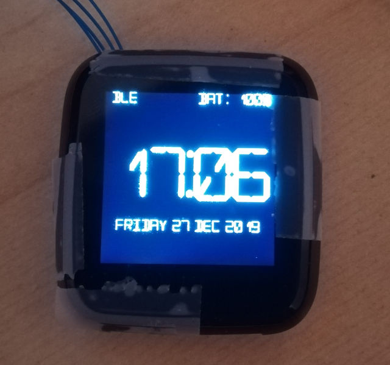

# PineTime
> The PineTime is a free and open source smartwatch capable of running custom-built open operating systems. Some of the notable features include a heart rate monitor, a week-long battery as well as a capacitive touch IPS display that is legible in direct sunlight. It is a fully community driven side-project, which means that it will ultimately be up to the developers and end-users to determine when they deem the PineTime ready to ship.

> We envision the PineTime as a companion for not only your PinePhone but also for your favorite devices — any phone, tablet, or even PC.

*https://www.pine64.org/pinetime/* 

The goal of this project is to build a firmware designed for the PineTime around FreeRTOS.
It's coded using a mix of C and C++ : the NRF52-SDK and FreeRTOS are written in C, but I prefer to write my own code in C++.

Please **NOTE : for now, this project is in heavy development state**. Feel free to use it, contribute to it or fork it !

This project is based on https://github.com/JF002/nrf52-baseproject.
It's a CMake project that configure everything needed to build applications for the PineTime (https://wiki.pine64.org/index.php/PineTime).

I tested this project (compile only) with the following versions:

  * gcc-arm-none-eabi-8-2019-q3-update (from https://developer.arm.com/tools-and-software/open-source-software/developer-tools/gnu-toolchain/gnu-rm/downloads)
  * nRF5_SDK_15.3.0_59ac345 (from https://www.nordicsemi.com/Software-and-Tools/Software/nRF5-SDK)
  
I've tested this project on the actual PineTime hardware.

## Current state



 * Project builds and runs on the Pinetime;
 * Logs available via JLink RTT;
 * Basic (but faster) LCD driver.
 * One big font to display the time (hours : minutes)
 * BLE advertising, connection and bonding
 * BLE CTS client (retrieves the time from the connected device if it implements a CTS server)
 * Push button to go to disable screen (and go to low power mode) / enable screen (and wake-up). **NOTE** : I'm not completely sure the power consumption is optimal, especially in sleep mode. Any help to measure and debug this is welcome.
 * Touch panel : wake up when sleeping and draw square on screen when running 

## Stub using NRF52-DK


See [this page](./doc/PinetimeStubWithNrf52DK.md)

## How to build

  * Download and unzip arm-none-eabi and NRF52 SDK
  * Clone this repo
  * **[JLINK]** Call CMake with the following command line argument
  
      - -DARM_NONE_EABI_TOOLCHAIN_PATH=[Path to the toolchain directory] 
      - -DNRF5_SDK_PATH=[Path to the SDK directory]
      - -DUSE_JLINK=1
      - -DNRFJPROG=[Path to NRFJProg executable]
      
  * OR
  * **[GDB CLIENT (if you use a BlackMagicProbe, for example)]** Call CMake with the following command line argument
                                                                        
        - -DARM_NONE_EABI_TOOLCHAIN_PATH=[Path to the toolchain directory] 
        - -DNRF5_SDK_PATH=[Path to the SDK directory]
        - -DUSE_GDB_CLIENT=1
        - -DGDB_CLIENT_BIN_PATH=[Path to arm-none-eabi-gdb executable]
        - -DGDB_CLIENT_TARGET_REMOTE=[Target remote connetion string. Ex : /dev/ttyACM0]
        
  * Optionally, you can define MERGEHEX with the path to the ```mergehex``` tool from [NRF5X Command Line Tools](https://infocenter.nordicsemi.com/index.jsp?topic=%2Fug_nrf5x_cltools%2FUG%2Fcltools%2Fnrf5x_command_line_tools_lpage.html&cp=6_1) to be able to merge the application and softdevice into one HEX file. In this case the merged file is generated in src/pinetime-app-full.hex
    
        - -DMERGEHEX=[Path to the mergehex executable]

JLINK
```
$ mkdir build
$ cd build
$ cmake -DCMAKE_BUILD_TYPE=Debug -DARM_NONE_EABI_TOOLCHAIN_PATH=... -DNRF5_SDK_PATH=... -DUSE_JLINK=1 -DNRFJPROG=... ../
```

GDB (Back Magic Probe)
```
$ mkdir build
$ cd build
$ cmake -DARM_NONE_EABI_TOOLCHAIN_PATH=... -DNRF5_SDK_PATH=... -DUSE_GDB_CLIENT=1 -DGDB_CLIENT_BIN_PATH=... -DGDB_CLIENT_TARGET_REMOTE=... -DMERGEHEX=... ../
```

  * Make
```
$ make -j pinetime-app
```  

## How to program

 * Erase
 
```
$ make FLASH_ERASE
```   

* Flash softdevice & application

```
$ make FLASH_SOFTDEVICE
$ make FLASH_pinetime-app
```

Or, with ```mergehex```

```
$ make FLASH_MERGED_pinetime-app
```

* For your information : list make targets :

```
$ make help
```


 

## RTT

RTT is a feature from Segger's JLink devices that allows bidirectionnal communication between the debugger and the target.
This feature can be used to get the logs from the embedded software on the development computer.

  * Program the MCU with the code (see above)
  * Start JLinkExe
  
```
$ JLinkExe -device nrf52 -if swd -speed 4000 -autoconnect 1
```

  * Start JLinkRTTClient
  
```
$ JLinkRTTClient
```

## Tools

 - https://github.com/eliotstock/memory : display the memory usage (FLASH/RAM) using the .map file from GCC.
 
## BLE connection, bonding and time synchronization
At runtime, BLE advertising is started. You can then use a smartphone or computer to connect and bond to your Pinetime. 
As soon as a device is bonded, Pinetime will look for a **CTS** server (**C**urrent **T**ime **S**ervice) on the connected device.

Here is how to do it with an Android smartphone running NRFConnect:

* Build and program the firmware on the Pinetime
* Install NRFConnect (https://www.nordicsemi.com/Software-and-Tools/Development-Tools/nRF-Connect-for-desktop)
* Start NRFConnect and create a CTS server : 
    - Tap the hamburger button on the top left and select "Configure GATT server"
    - Tap "Add service" on the bottom
    - Select server configuration "Current Time Service" and tap OK
* Go back to the main screen and scan for BLE devices. A device called "PineTime" should appear
* Tap the button "Connect" next to the PineTime device. It should connect to the PineTime and switch to a new tab.
* On this tab, on the top right, there is a 3 dots button. Tap on it and select Bond. The bonding process begins, and if it is sucessful, the PineTime should update its time and display it on the screen.
      