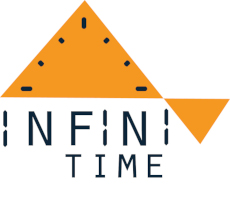
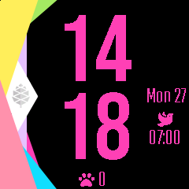

# [InfiniTime](https://github.com/Eve1374/InfiniTime)

Fast open-source firmware for the [PineTime smartwatch](https://pine64.org/devices/pinetime/) with many features, written in modern C++.

Original repo : [InfiniTime](https://github.com/InfiniTimeOrg/InfiniTime)

- [Getting started with InfiniTime](doc/gettingStarted/gettingStarted-1.0.md)
- [Updating the software](doc/gettingStarted/updating-software.md)
- [About the firmware and bootloader](doc/gettingStarted/about-software.md)
- [Available apps](doc/gettingStarted/Applications.md)
- [Available watch faces](/doc/gettingStarted/Watchfaces.md)
- [PineTimeStyle Watch face](https://pine64.org/documentation/PineTime/Watchfaces/PineTimeStyle)
  - [Weather integration](https://pine64.org/documentation/PineTime/Software/InfiniTime_weather/)

## Welcome to my InfiniTime fork ?!

Branches :

- main : shows this doc
- alarm-status-on-infineat : shows the alarm status on infineat, can be enabled or disabled from the settigns menu that is updated accordingly :

- my-custom-infinitime : branch were I put things that I want for myself, like a watchface with paw instead of shoe icon for steps counter :

### Contributing

- [How to contribute](CONTRIBUTING.md)
- [Coding conventions](doc/coding-convention.md)

### Build, flash and debug

- [InfiniTime simulator](https://github.com/InfiniTimeOrg/InfiniSim)
- [Build the project](doc/buildAndProgram.md)
- [Build the project with Docker](doc/buildWithDocker.md)
- [Build the project with VSCode](doc/buildWithVScode.md)
- [Flash the firmware using OpenOCD and STLinkV2](doc/openOCD.md)
- [Flash the firmware using SWD interface](doc/SWD.md)
- [Flash the firmware using JLink](doc/jlink.md)
- [Flash the firmware using GDB](doc/gdb.md)
- [Stub using NRF52-DK](doc/PinetimeStubWithNrf52DK.md)

### API

- [BLE implementation and API](doc/ble.md)

### Architecture and technical topics

- [Memory analysis](doc/MemoryAnalysis.md)

### Project management

- [Maintainer's guide](doc/maintainer-guide.md)
- [Versioning](doc/versioning.md)
- [Project branches](doc/branches.md)
- [Files included in the release notes](doc/filesInReleaseNotes.md)
- [Files needed by the factory](doc/files-needed-by-factory.md)

## Licenses

This project is released under the GNU General Public License version 3 or, at your option, any later version.

It integrates the following projects:

- RTOS: **[FreeRTOS](https://freertos.org)** under the MIT license
- UI: **[LittleVGL/LVGL](https://lvgl.io/)** under the MIT license
- BLE stack: **[NimBLE](https://github.com/apache/mynewt-nimble)** under the Apache 2.0 license
- Font: **[Jetbrains Mono](https://www.jetbrains.com/fr-fr/lp/mono/)** under the Apache 2.0 license

## Credits

I’m not working alone on this project. First, many people create pull requests for this project. Then, there is the whole #pinetime community: a lot of people all around the world who are hacking, searching, experimenting and programming the Pinetime. We exchange our ideas, experiments and code in the chat rooms and forums.

Here are some people I would like to highlight:

- [Atc1441](https://github.com/atc1441/): He works on an Arduino based firmware for the Pinetime and many other smartwatches based on similar hardware. He was of great help when I was implementing support for the BMA421 motion sensor and I²C driver.
- [Koen](https://github.com/bosmoment): He’s working on a firmware based on RiotOS. He integrated similar libs as me: NimBLE, LittleVGL,… His help was invaluable too!
- [Lup Yuen Lee](https://github.com/lupyuen): He is everywhere: he works on a Rust firmware, builds a MCUBoot based bootloader for the Pinetime, designs a Flutter based companion app for smartphones and writes a lot of articles about the Pinetime!
