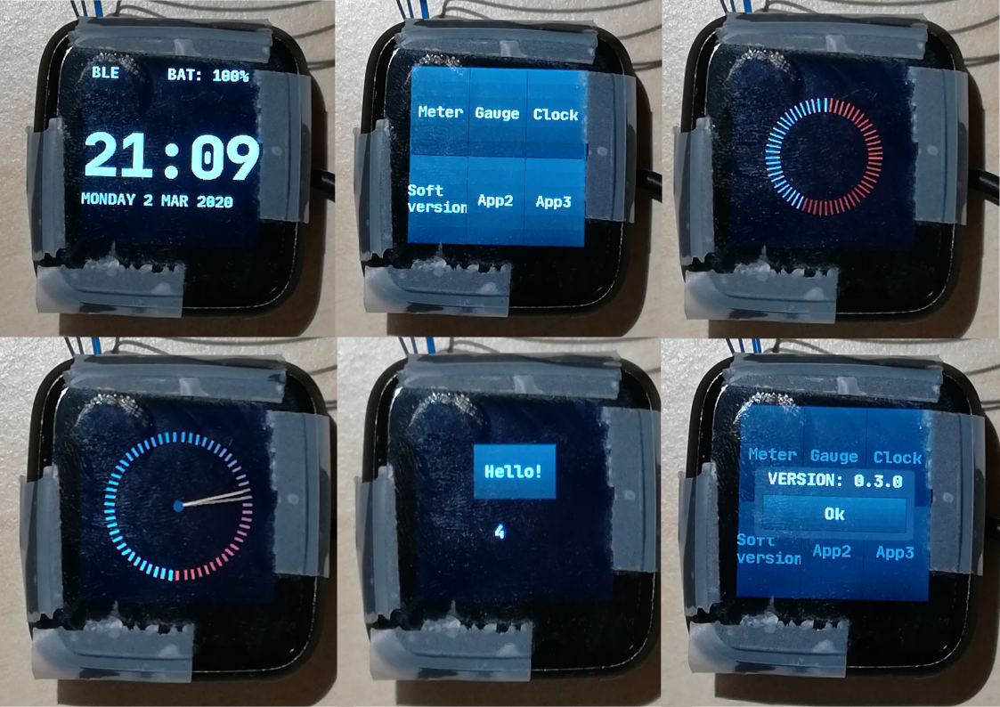

# PineTime
> The PineTime is a free and open source smartwatch capable of running custom-built open operating systems. Some of the notable features include a heart rate monitor, a week-long battery as well as a capacitive touch IPS display that is legible in direct sunlight. It is a fully community driven side-project, which means that it will ultimately be up to the developers and end-users to determine when they deem the PineTime ready to ship.

> We envision the PineTime as a companion for not only your PinePhone but also for your favorite devices — any phone, tablet, or even PC.

*https://www.pine64.org/pinetime/* 

The goal of this project is to build a firmware designed for the PineTime around FreeRTOS.
It's coded using a mix of C and C++ : the NRF52-SDK and FreeRTOS are written in C, but I prefer to write my own code in C++.

Please **NOTE : for now, this project is in heavy development state**. Feel free to use it, contribute to it or fork it !

This project is based on https://github.com/JF002/nrf52-baseproject.
It's a CMake project that configure everything needed to build applications for the PineTime (https://wiki.pine64.org/index.php/PineTime).

I tested this project (compile only) with the following versions:

  * gcc-arm-none-eabi-8-2019-q3-update (from https://developer.arm.com/tools-and-software/open-source-software/developer-tools/gnu-toolchain/gnu-rm/downloads)
  * nRF5_SDK_15.3.0_59ac345 (from https://www.nordicsemi.com/Software-and-Tools/Software/nRF5-SDK)
  
I've tested this project on the actual PineTime hardware.

## Current state



 * Project builds and runs on the Pinetime;
 * Logs available via JLink RTT;
 * SPI (DMA & IRQ based) LCD driver;
 * BLE advertising, connection and bonding;
 * BLE CTS client (retrieves the time from the connected device if it implements a CTS server);
 * Push button to go to disable screen (and go to low power mode) / enable screen (and wake-up) and UI navigation
 * Touch panel support;
 * Rich user interface (using [LittleVGL](https://littlevgl.com/)) via display, touchpanel and push button.
 * Digital watch face and 4 demo applications (spinning meter, analog gauche, push button and message box);
 * Watchdog (automatic reset in case of firmware crash) and reset support (push and hold the button for 7 - 10s);
 * BLE Notification support (still Work-In-Progress, [companion app](https://github.com/JF002/gobbledegook) needed). 

## Documentation

 * [BLE implementation and API](./doc/ble.md)

## Stub using NRF52-DK


See [this page](./doc/PinetimeStubWithNrf52DK.md)

## How to build

  1. Download and unzip arm-none-eabi
  2. Clone this repo

     * This repo comes with the NRF52 SDK as git submodule so you can pull in all dependencies at one using:
      `git clone --recurse-submodules git@github.com:JF002/Pinetime.git`
     * If you already have the NRF52 SDK installed you can ignore cloning the submodules
  
  3. Create build directory and navigate to it:

      ```
      $ mkdir build
      $ cd build
      ```

  4. Call CMake with following command line arguments:

     * **[JLINK]**
  
       - -DARM_NONE_EABI_TOOLCHAIN_PATH=[Path to the toolchain directory]
       - -DNRF5_SDK_PATH=../NrfSDK
       - -DUSE_JLINK=1
       - -DNRFJPROG=[Path to NRFJProg executable]

        ```
        $ cmake -DCMAKE_BUILD_TYPE=Debug -DARM_NONE_EABI_TOOLCHAIN_PATH=... -DNRF5_SDK_PATH=../NrfSDK -DUSE_JLINK=1 -DNRFJPROG=... ../
        ```
      
     * **[GDB CLIENT (if you use a BlackMagicProbe, for example)]**
                                                                        
        - -DARM_NONE_EABI_TOOLCHAIN_PATH=[Path to the toolchain directory]
        - -DNRF5_SDK_PATH=../NrfSDK
        - -DUSE_GDB_CLIENT=1
        - -DGDB_CLIENT_BIN_PATH=[Path to arm-none-eabi-gdb executable]
        - -DGDB_CLIENT_TARGET_REMOTE=[Target remote connetion string. Ex : /dev/ttyACM0]
        
        ```
        $ cmake -DARM_NONE_EABI_TOOLCHAIN_PATH=... -DNRF5_SDK_PATH=../NrfSDK -DUSE_GDB_CLIENT=1 -DGDB_CLIENT_BIN_PATH=... -DGDB_CLIENT_TARGET_REMOTE=... -DMERGEHEX=... ../
        ```

     * **[OPENOCD (if you use a STlink v2 clone, for example)]**
                                                                      
        - -DARM_NONE_EABI_TOOLCHAIN_PATH=[Path to the toolchain directory]
        - -DNRF5_SDK_PATH=../NrfSDK
        - -DUSE_OPENOCD=1
        
        * Optionally, if you want to use a another version then whats on your path
   
            - -DOPENOCD_BIN_PATH=[path to openocd]

        ```
        $ cmake -DARM_NONE_EABI_TOOLCHAIN_PATH=... -DNRF5_SDK_PATH=../NrfSDK -DUSE_OPENOCD=1 -DGDB_CLIENT_BIN_PATH=[optional] -DMERGEHEX=... ../
        ```

     * Optionally, you can define MERGEHEX with the path to the ```mergehex``` tool from [NRF5X Command Line Tools](https://infocenter.nordicsemi.com/index.jsp?topic=%2Fug_nrf5x_cltools%2FUG%2Fcltools%2Fnrf5x_command_line_tools_lpage.html&cp=6_1) to be able to merge the application and softdevice into one HEX file. In this case the merged file is generated in src/pinetime-app-full.hex
    
        - -DMERGEHEX=[Path to the mergehex executable]

     * Optionally if you have the NRF SDK installed in some place else you can configure it in the follow way:

        - -DNRF5_SDK_PATH=[Path to the SDK directory]

  5. Make

      ```
      $ make -j pinetime-app
      ```


## How to program
### Using make

 * Erase
 
```
$ make FLASH_ERASE
```   

* Flash softdevice & application

```
$ make FLASH_SOFTDEVICE
$ make FLASH_pinetime-app
```

Or, with ```mergehex```

```
$ make FLASH_MERGED_pinetime-app
```

* For your information : list make targets :

```
$ make help
```

### Using GDB and a Black Magic Probe (BMP)
You can use this procedure if you want to flash the firmware (from a release, for example) without having to build the project locally.

Enter the following command into GDB:

```
target extended-remote /dev/ttyACM0
monitor swdp_scan
attach 1
file ./pinetime-app-full.hex 
load
run
```

*Note* : Sometimes, I need to run this procedure 2 times : the first time, the screen stays blank, and the second time, it works. This is something I'll need to debug...

Example:
```
$ /home/jf/nrf52/gcc-arm-none-eabi-8-2019-q3-update/bin/arm-none-eabi-gdb

(gdb) target extended-remote /dev/ttyACM0
Remote debugging using /dev/ttyACM0
(gdb) monitor swdp_scan
Target voltage: ABSENT!
Available Targets:
No. Att Driver
 1      Nordic nRF52 M3/M4
 2      Nordic nRF52 Access Port 

(gdb) attach 1
Attaching to Remote target
warning: No executable has been specified and target does not support
determining executable automatically.  Try using the "file" command.
0xfffffffe in ?? ()
(gdb) file ./pinetime-app-full.hex 
A program is being debugged already.
Are you sure you want to change the file? (y or n) y
Reading symbols from ./pinetime-app-full.hex...
(No debugging symbols found in ./pinetime-app-full.hex)
(gdb) load
Loading section .sec1, size 0xb00 lma 0x0
Loading section .sec2, size 0xf000 lma 0x1000
Loading section .sec3, size 0x10000 lma 0x10000
Loading section .sec4, size 0x5150 lma 0x20000
Loading section .sec5, size 0xa000 lma 0x26000
Loading section .sec6, size 0x10000 lma 0x30000
Loading section .sec7, size 0xdf08 lma 0x40000
Start address 0x0, load size 314200
Transfer rate: 45 KB/sec, 969 bytes/write.
```

## RTT

RTT is a feature from Segger's JLink devices that allows bidirectionnal communication between the debugger and the target.
This feature can be used to get the logs from the embedded software on the development computer.

  * Program the MCU with the code (see above)
  * Start JLinkExe
  
```
$ JLinkExe -device nrf52 -if swd -speed 4000 -autoconnect 1
```

  * Start JLinkRTTClient
  
```
$ JLinkRTTClient
```

## Tools

 - https://github.com/eliotstock/memory : display the memory usage (FLASH/RAM) using the .map file from GCC.
 
## BLE connection, bonding and time synchronization
At runtime, BLE advertising is started. You can then use a smartphone or computer to connect and bond to your Pinetime. 
As soon as a device is bonded, Pinetime will look for a **CTS** server (**C**urrent **T**ime **S**ervice) on the connected device.

### Using Android and NRFConnect
Here is how to do it with an Android smartphone running NRFConnect:

* Build and program the firmware on the Pinetime
* Install NRFConnect (https://www.nordicsemi.com/Software-and-Tools/Development-Tools/nRF-Connect-for-desktop)
* Start NRFConnect and create a CTS server : 
    - Tap the hamburger button on the top left and select "Configure GATT server"
    - Tap "Add service" on the bottom
    - Select server configuration "Current Time Service" and tap OK
* Go back to the main screen and scan for BLE devices. A device called "PineTime" should appear
* Tap the button "Connect" next to the PineTime device. It should connect to the PineTime and switch to a new tab.
* On this tab, on the top right, there is a 3 dots button. Tap on it and select Bond. The bonding process begins, and if it is sucessful, the PineTime should update its time and display it on the screen.

### Using Linux and bluetoothctl
* Ensure that your bluetooth controller is enabled and working fine. I've tested this on a x86 Debian computer and on a RaspberryPi 3.
* Run bluetoothctl as root : `sudo bluetoothctl`
* Enter the following commands:
  * `scan on` and wait for you Pinetime to be detected. Note the BLE MAC address
  * `scan off'
  * `trust <MAC ADDRESS>`
  * `pair <MAC ADDRESS>`
 * Wait for some time, and the connection should be established.
 
**NOTE : ** The commands above establish a BLE connection between your PC, but the time synchronization and notifications won't work because there is not CTS or ANS server running. I'm currently working on an application that'll provide both of these servers.

### Troubleshooting
If the connection cannot be established, or the time synchronization does not work, try the following steps.

On Android:
* Disable and re-enable your bluetooth device
* In NRFConnect,  in the device tab corresponding to your pinetime, tap on the menu on the top left of the screen and select "Delete bond information".
* Then re-try to bond/connect.

On Linux:
* Reset the bluetooth device : `sudo hciconfig hci0 reset`
* Restart the Bluetooth service : `sudo systemctl restart bluetooth.service`
* In bluetootctl:
  * `remove <MAC ADDRESS>`
  * `trust <MAC ADDRESS>`
  * `pair <MAC ADDRESS>`
  
Note that the current firmware only advertise for the first 3 minutes. If you cannot connect after more than 3 minutes, try resetting the device (push the button and hold it for 7-10 seconds).