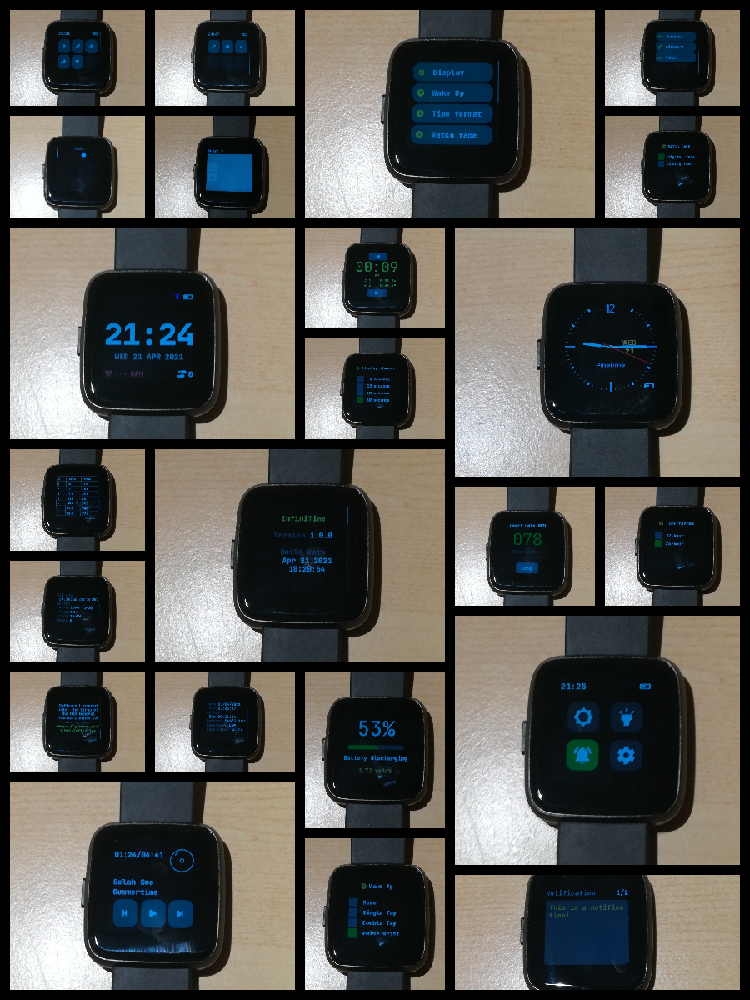

# InfiniTime

The goal of this project is to design an open-source firmware for the [Pinetime smartwatch](https://www.pine64.org/pinetime/) :

 - Code written in **modern C++**;
 - Build system based on **CMake**;
 - Based on **[FreeRTOS 10.0.0](https://freertos.org)** real-time OS.
 - Using **[LittleVGL/LVGL 7](https://lvgl.io/)** as UI library...
 - ... and **[NimBLE 1.3.0](https://github.com/apache/mynewt-nimble)** as BLE stack.

## New to InfiniTime?

 - [Getting started with InfiniTime 1.0 (quick user guide, update bootloader and InfiniTime,...)](doc/gettingStarted/gettingStarted-1.0.md)
 - [Flash, upgrade (OTA), time synchronization,...](doc/gettingStarted/ota-gadgetbridge-nrfconnect.md)

## Overview

As of now, here is the list of achievements of this project:

 - Fast and optimized LCD driver
 - BLE communication
 - Rich user interface via display, touchscreen and pushbutton
 - Time synchronization via BLE
 - Notification via BLE
 - Heart rate measurements
 - Step counting
 - Wake-up on wrist rotation
 - Quick actions
    * Disable vibration on notification
    * Brightness settings
    * Flashlight
    * Settings
 - 3 watch faces:
    * Digital
    * Analog
    * [PineTimeStyle](https://wiki.pine64.org/wiki/PineTimeStyle)
 - Multiple 'apps' :
    * Music (control the playback of music on your phone)
    * Heart rate (measure your heart rate)
    * Navigation (displays navigation instructions coming from the companion app)
    * Notification (displays the last notification received)
    * Paddle (single player pong-like game)
    * Twos (2048 clone game)
    * Stopwatch
    * Steps (displays the number of steps taken)
    * Timer (set a countdown timer that will notify you when it expires)
    * Metronome (vibrates to a given bpm with a customizable beats per bar)
 - User settings:
    * Display timeout
    * Wake-up condition
    * Time format (12/24h)
    * Default watch face
    * Daily step goal
    * Battery status
    * Firmware validation
    * System information
 - Supported by 3 companion apps (development is in progress):
    * [Gadgetbridge](https://codeberg.org/Freeyourgadget/Gadgetbridge/) (on Android via F-Droid)
    * [Amazfish](https://openrepos.net/content/piggz/amazfish) (on SailfishOS and Linux)
    * [Siglo](https://github.com/alexr4535/siglo) (on Linux)
    * **[Experimental]** [WebBLEWatch](https://hubmartin.github.io/WebBLEWatch/) Synchronize time directly from your web browser. [video](https://youtu.be/IakiuhVDdrY)
    * **[Experimental]** [Infini-iOS](https://github.com/xan-m/Infini-iOS) (on iOS)
 - OTA (Over-the-air) update via BLE
 - [Bootloader](https://github.com/JF002/pinetime-mcuboot-bootloader) based on [MCUBoot](https://juullabs-oss.github.io/mcuboot/)

## Documentation

### Develop

 - [Generate the fonts and symbols](src/displayapp/fonts/README.md)
 - [Creating a stopwatch in Pinetime(article)](https://pankajraghav.com/2021/04/03/PINETIME-STOPCLOCK.html)

### Build, flash and debug

 - [Project branches](doc/branches.md)
 - [Versioning](doc/versioning.md)
 - [Files included in the release notes](doc/filesInReleaseNotes.md)
 - [Build the project](doc/buildAndProgram.md)
 - [Flash the firmware using OpenOCD and STLinkV2](doc/openOCD.md)
 - [Build the project with Docker](doc/buildWithDocker.md)
 - [Build the project with VSCode](doc/buildWithVScode.md)
 - [Bootloader, OTA and DFU](./bootloader/README.md)
 - [Stub using NRF52-DK](./doc/PinetimeStubWithNrf52DK.md)
 - Logging with JLink RTT.
 - Using files from the releases

### Contribute

 - [How to contribute ?](doc/contribute.md)

### API

 - [BLE implementation and API](./doc/ble.md)

### Architecture and technical topics

 - [Memory analysis](./doc/MemoryAnalysis.md)

### Using the firmware

 - [Integration with Gadgetbridge](doc/companionapps/Gadgetbridge.md)
 - [Integration with AmazFish](doc/companionapps/Amazfish.md)
 - [Firmware update, OTA](doc/companionapps/NrfconnectOTA.md)

## TODO - contribute

This project is far from being finished, and there are still a lot of things to do for this project to become a firmware usable by the general public.

Here a quick list out of my head of things to do for this project:

 - Improve BLE communication stability and reliability
 - Improve OTA and MCUBoot bootloader
 - Add more functionalities : Alarm, chronometer, configuration, activities, heart rate logging, games,...
 - Add more BLE functionalities : call notifications, agenda, configuration, data logging,...
 - Measure power consumption and improve battery life
 - Improve documentation, take better pictures and video than mine
 - Improve the UI
 - Create companion app for multiple OSes (Linux, Android, iOS) and platforms (desktop, ARM, mobile). Do not forget the other devices from Pine64 like [the Pinephone](https://www.pine64.org/pinephone/) and the [Pinebook Pro](https://www.pine64.org/pinebook-pro/).
 - Design a simple CI (preferably self-hosted and easy to reproduce).

Do not hesitate to clone/fork the code, hack it and create pull-requests. I'll do my best to review and merge them :)

## Licenses

This project is released under the GNU General Public License version 3 or, at your option, any later version.

It integrates the following projects:
 - RTOS : **[FreeRTOS](https://freertos.org)** under the MIT license
 - UI : **[LittleVGL/LVGL](https://lvgl.io/)** under the MIT license
 - BLE stack : **[NimBLE](https://github.com/apache/mynewt-nimble)** under the Apache 2.0 license
 - Font : **[Jetbrains Mono](https://www.jetbrains.com/fr-fr/lp/mono/)** under the Apache 2.0 license

## Credits

I’m not working alone on this project. First, many people create PR for this projects. Then, there is the whole #pinetime community : a lot of people all around the world who are hacking, searching, experimenting and programming the Pinetime. We exchange our ideas, experiments and code in the chat rooms and forums.

Here are some people I would like to highlight:

 - [Atc1441](https://github.com/atc1441/) : He works on an Arduino based firmware for the Pinetime and many other smartwatches based on similar hardware. He was of great help when I was implementing support for the BMA421 motion sensor and I²C driver.
 - [Koen](https://github.com/bosmoment) : He’s working on a firmware based on RiotOS. He integrated similar libs as me : NimBLE, LittleVGL,… His help was invaluable too!
 - [Lup Yuen Lee](https://github.com/lupyuen) : He is everywhere: he works on a Rust firmware, builds a MCUBoot based bootloader for the Pinetime, designs a Flutter based companion app for smartphones and writes a lot of articles about the Pinetime!

*If you feel like you should appear on this list, just get in touch with me or submit a PR :)*
