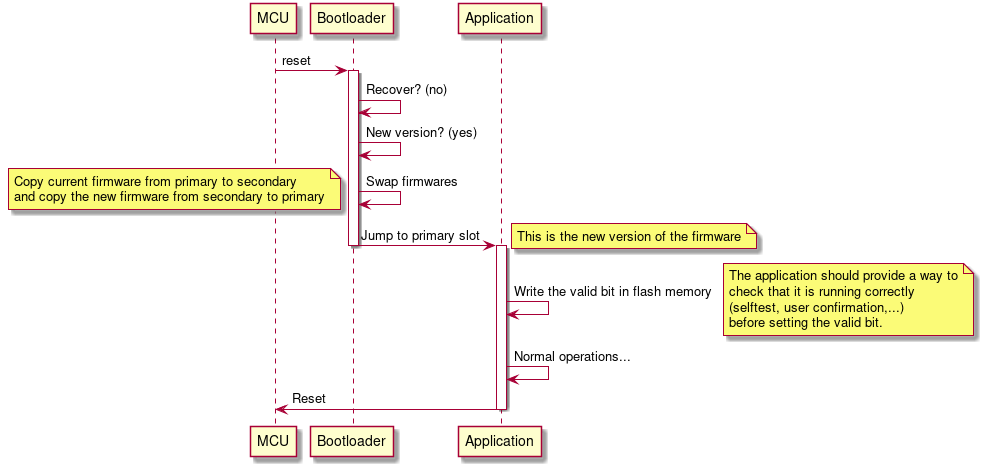
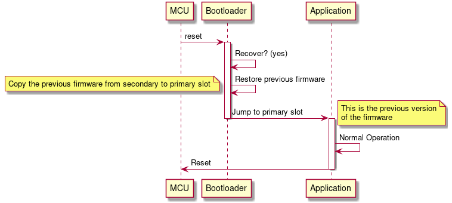
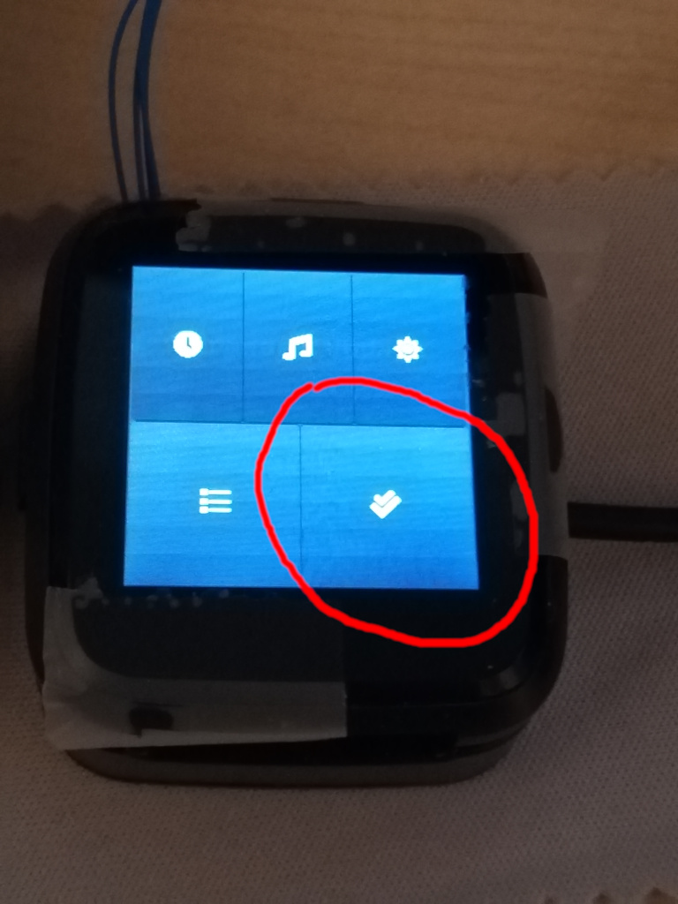
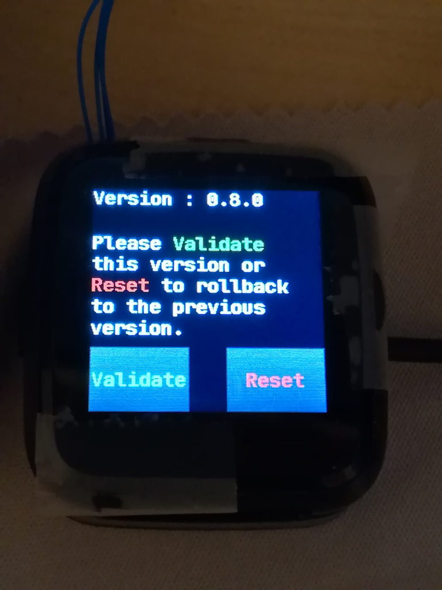
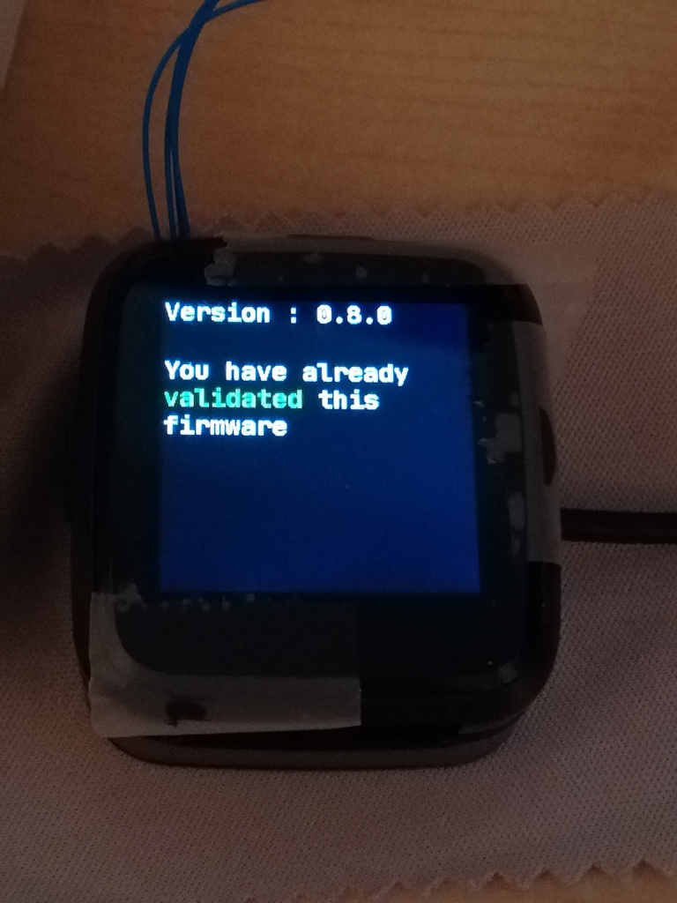

# About this bootloader

The [bootloader](https://github.com/lupyuen/pinetime-rust-mynewt/tree/master/libs/pinetime_boot/src) is mostly developed by [Lup Yuen](https://github.com/lupyuen). It is based on [MCUBoot](https://www.mcuboot.com) and [Mynewt](https://mynewt.apache.org/).

The goal of this project is to provide a common bootloader for multiple (all?) Pinetime projects. It allows to upgrade the current bootloader and even replace the current application by another one that supports the same bootloader.

As we wanted this bootloader to be as universal as possible, we decided that it should **not** integrate a BLE stack and provide OTA capabilities.

Integrating a BLE stack for the OTA functionality would have used to much memory space and/or forced all the firmware developers to use the same BLE stack as the bootloader.

When it is run, this bootloader looks in the SPI flash memory if a new firmware is available. It there is one, it *swaps* the current firmware with the new one (the new one is copied in the main flash memory, and the current one is copied in the SPI flash memory) and run the new one. If the new one fails to run properly, the bootloader is able to revert to the old one and mark the new one as not working.

As this bootloader does not provide any OTA capability, it is not able to actually download a new version of the application. Providing OTA functionality is thus the responsibility of the application firmware.

# About MCUBoot

MCUBoot is run at boot time. In normal operation, it just jumps to the reset handler of the application firmware to run it. Once the application firmware is running, MCUBoot does not run at all.


But MCUBoot does much more than that : it can upgrade the firmware that is currently running by a new one, and it is also able to revert to the previous version of the firmware in case the new one does not run properly.

To do this, it uses 2 memory 'slots' :

- **The primary slot** : it contains the current firmware, the one that will be executed by MCUBoot
- **The secondary slot** : it is used to store the upgraded version of the firmware, when available.

At boot time, MCUBoot detects that a new version of the firmware is available in the secondary slot and swaps them : the current version of the firmware is copied from the primary to the secondary slot and vice-versa.

When the swapping is done, it runs the new version of the firmware from the primary slot.



The next time MCUBoot will be run (after a MCU reset), MCUBoot will check if the new firmware ran correctly (it must set a flag in memory). If it is not the case, it'll revert to the previous version of the firmware by copying it from the secondary to the primary.



Note than MCUBoot **does not** provide any means to download and store the new version of the firmware into the secondary slot. This must be implemented by the application firmware.

# Degraded cases

This chapter describes degraded cases that are handled by our bootloader and those that are not supported.

Case | Current bootloader | Solution
-----|--------------------|----------------------------------------------
Data got corrupted during file transfer | [OK] Application firmware does a CRC check before applying the update, and does not proceed if it fails. | N/A
New firmware does not run at all (bad file) (1) | [NOK] MCU executes unknown instructions and will most likely end up in an infinite loop or freeze in an error handler. The bootloader does not run, it can do nothing, the MCU is stuck until next reset | [OK] The bootloader starts the watchdog just before running the new firmware. This way, the watchdog will reset the MCU after ~7s because the firmware does not refresh it. Bootloader reverts to the previous version of the firmware during the reset.
New firmware runs, does not set the valid bit and does not refresh the watchdog | [NOK] The new firmware runs until the next reset. The bootloader will be able to revert to the previous firmware only during the next reset. If the new firmware does not run properly and does not reset, the bootloader can do nothing until the next reset | [OK] The bootloader starts the watchdog just before running the new firmware. This way, the watchdog will reset the MCU after ~7s because the firmware does not refresh it. Bootloader reverts to the previous version of the firmware during the reset.
New firmware does not run properly, does not set the valid bit but refreshes the watchdog | [NOK] The bootloader will be able to revert to the previous firmware only during the next reset. If the new firmware does not run properly and does not reset, the bootloader can do nothing until the next reset | [~] Wait for the battery to drain. The CPU will reset the next time the device is charged and will be able to rollback to the previous version.
New firmware does not run properly but sets the valid bit and refreshes the watchdog | [NOK] The bootloader won't revert to the previous version because the valid flag is set | [~] Wait for the battery to drain. The CPU will reset the next time the device is charged. Then, the bootloader must provide a way for the user to force the rollback to the previous version

*(1) I've observed this when I tried to run a firmware built to run from offset 0 while it was flashed at offset 0x8000 in memory (bad vector table).*

# Using the bootloader

## Bootloader graphic

The bootloader loads a graphic (Pinetime logo) from the SPI Flash memory. If this graphic is not loaded in the memory, the LCD will display garbage (the content of the SPI flash memory).

The SPI Flash memory is not accessible via the SWD debugger. Use the firmware 'pinetime-graphics' to load the graphic into memory. All you have to do is build it and program it at address 0x00 :

- Build:

```sh
make pinetime-graphics
```

- Program (using OpenOCD for example) :

```
program pinetime-graphics.bin 0
```

- Let it run for ~10s (it does nothing for 5 seconds, then write the logo into the SPI memory, then (slowly) displays it on the LCD).

## Bootloader binary

The binary comes from https://github.com/lupyuen/pinetime-rust-mynewt/releases/tag/v5.0.4

It must be flash at address **0x00** in the internal flash memory.

Using OpenOCD:

`program bootloader-5.0.4.bin 0`

## Application firmware image

Build the binary compatible with the booloader:

`make pinetime-mcuboot-app`

The binary is located in *<build directory>/src/pinetime-mcuboot-app.bin*.

It must me converted into a MCUBoot image using *imgtool.py* from [MCUBoot](https://github.com/mcu-tools/mcuboot/tree/master/scripts). Simply checkout the project and run the script <mcuboot root>/scripts/imgtool.py with the following command line:

```sh
imgtool.py create --align 4 --version 1.0.0 --header-size 32 --slot-size 475136 --pad-header <build directory>/src/pinetime-mcuboot-app.bin image.bin
```

The image must be then flashed at address **0x8000** in the internal flash memory.

Using OpenOCD:

`program image.bin 0x8000`

## OTA and DFU

Pack the image into a .zip file for the NRF DFU protocol:

```sh
adafruit-nrfutil dfu genpkg --dev-type 0x0052 --application image.bin dfu.zip
```

Use NRFConnect or dfu.py (in <project root>/bootloader/ota-dfu-python) to upload the zip file to the device:

```sh
sudo dfu.py -z /home/jf/nrf52/bootloader/dfu.zip -a <pinetime MAC address> --legacy
```

**Note** : dfu.py is a slightly modified version of [this repo](https://github.com/daniel-thompson/ota-dfu-python).

### Firmware validation

Once the OTA is done, InfiniTime will reset the watch to apply the update. When the watch reboots, the new firmware is running.

One last step is needed to finalize the upgrade : the new firmware must be manually validated. If the watch resets while the image is not validated, the bootloader will automatically revert to the previous version of the firmware.

If the new firmware is working correctly, open the application menu and tap on the 'check' app. This apps displays the version of the firmware that is currently running, and allows you to validate the firmware, or reset the device to rollback to the previous version.

Firmware validation application in the menu:



The firmware is not validated yet. Tap 'Validate' to validate it, or 'Reset' to rollback to the previous version.



The firmware is validated!


