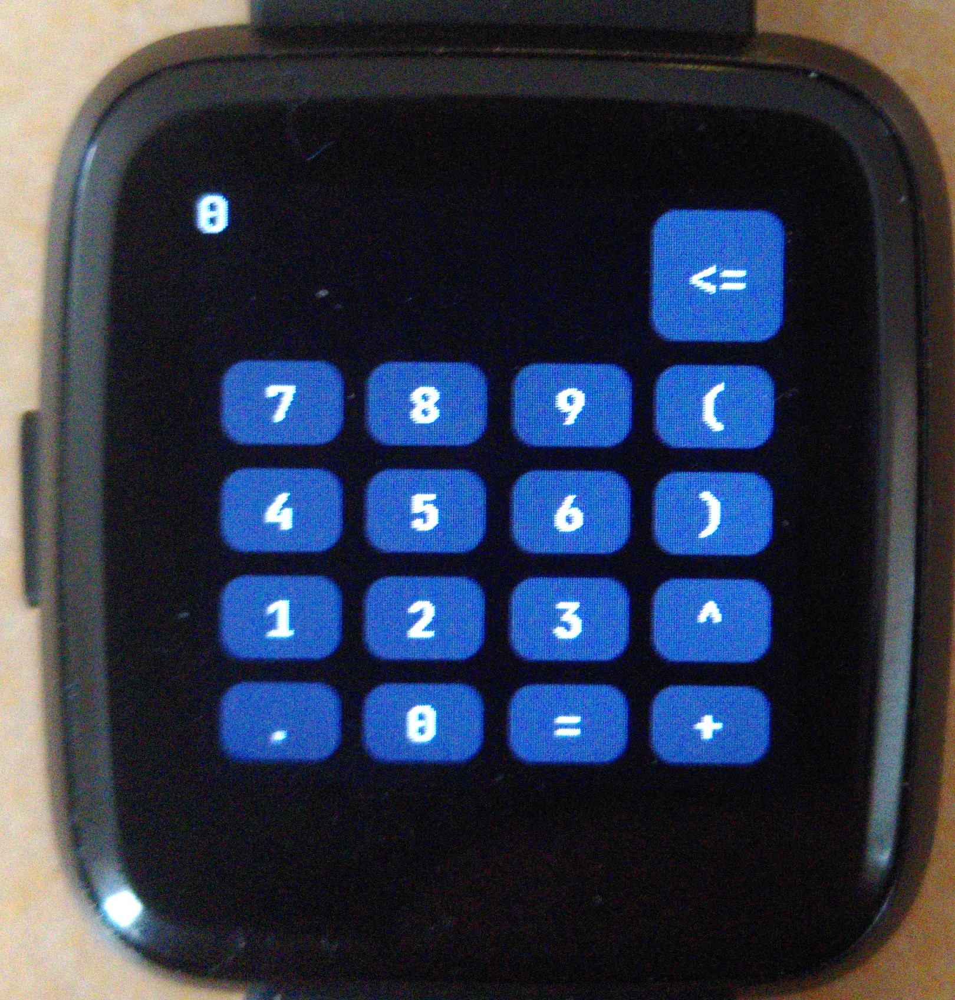

# Calculator Manual
This is a simple Calculator with support for the four basic arithmetic operations, parenthesis and exponents.
Here is what you need to know to make full use of it:
- Swipe left to access parenthesis and exponents:
   
- A long tap on the screen will reset the text field to `0`.
- If the entered term is invalid, the watch will vibrate.
- results are rounded to 4 digits after the decimal point
- **TIP:** you can use `^(1/2)` to calculate square roots
