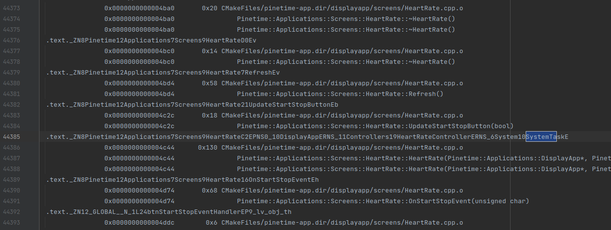
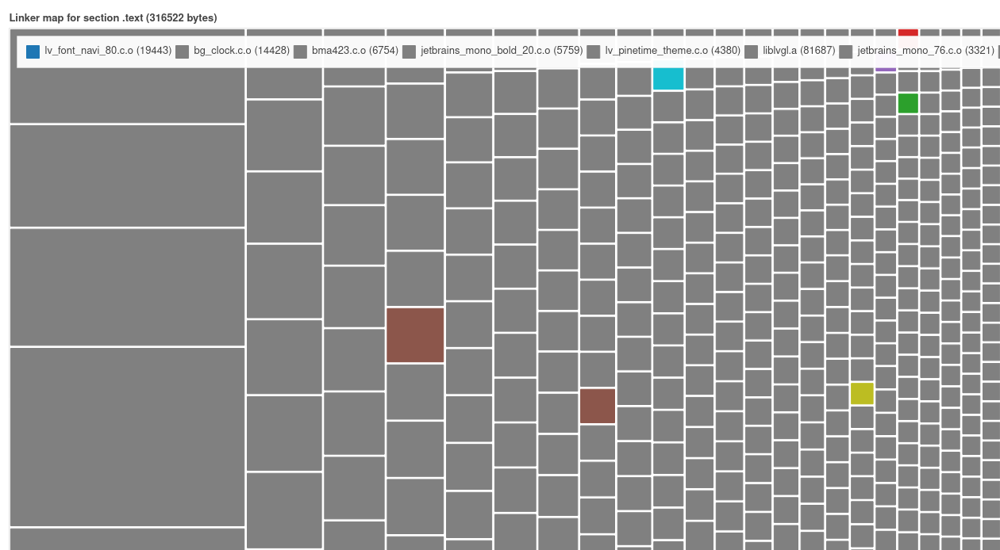
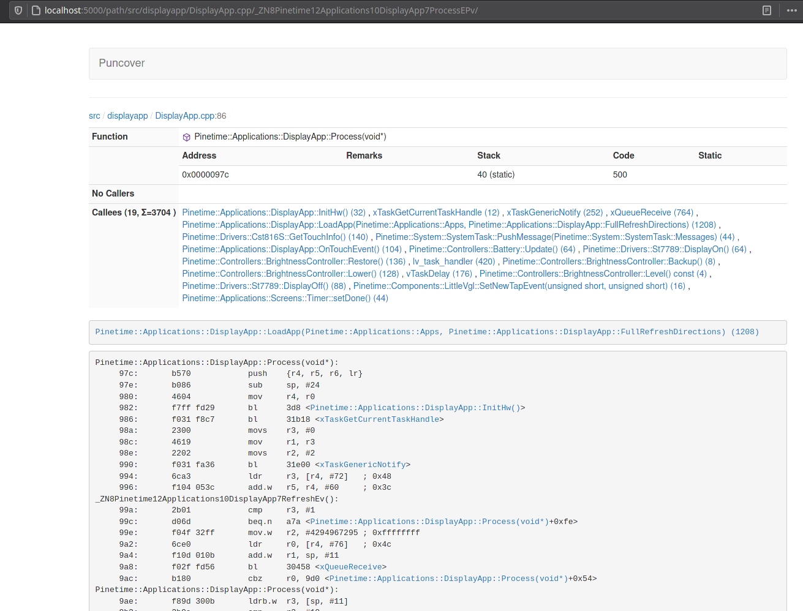
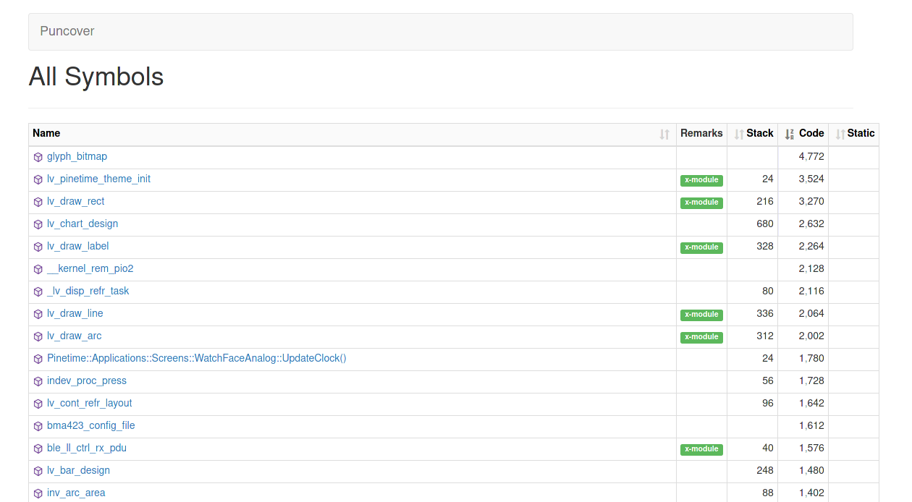

# Memory analysis

The PineTime is equipped with the following memories:

- The internal RAM : **64KB**
- The internal Flash : **512KB**
- The external (SPI) Flash : **4MB**

Note that the NRF52832 cannot execute code stored in the external flash : we need to store the whole firmware in the internal flash memory, and use the external one to store graphicals assets, fonts...

This document describes how the RAM and Flash memories are used in InfiniTime and how to analyze and monitor their usage. It was written in the context of [this memory analysis effort](https://github.com/InfiniTimeOrg/InfiniTime/issues/313).

## Code sections

A binary is composed of multiple sections. Most of the time, these sections are : .text, .rodata, .data and .bss but more sections can be defined in the linker script.

Here is a small description of these sections and where they end up in memory:

- **TEXT** = code (FLASH)
- **RODATA** = constants (FLASH)
- **DATA** = initialized variables (FLASH + RAM)
- **BSS** = uninitialized variables (RAM)

## Internal FLASH

The internal flash memory stores the whole firmware: code, variable that are not default-initialized, constants...

The content of the flash memory can be easily analyzed thanks to the MAP file generated by the compiler. This file lists all the symbols from the program along with their size and location (section and addresses) in RAM and FLASH.



As you can see on the picture above, this file contains a lot of information and is not easily readable by a human being. Fortunately, you can easily find tools that parse and display the content of the MAP file in a more understandable way.

In this analysis, I used [Linkermapviz](https://github.com/PromyLOPh/linkermapviz).

### Linkermapviz

[Linkermapviz](https://github.com/PromyLOPh/linkermapviz) parses the MAP file and displays its content on an HTML page as a graphic:



Using this tool, you can compare the relative size of symbols. This can be helpful for checking memory usage at a glance.

Also, as Linkermapviz is written in Python, you can easily modify and adapt it to your firmware or export data in another format. For example, [here it is modified to parse the contents of the MAP file and export it in a CSV file](https://github.com/InfiniTimeOrg/InfiniTime/issues/313#issuecomment-842338620). This file could later be opened in LibreOffice Calc where sort/filter functionality could be used to search for specific symbols in specific files...

### Puncover

[Puncover](https://github.com/HBehrens/puncover) is another useful tools that analyses the binary file generated by the compiler (the .out file that contains all debug information). It provides valuable information about the symbols (data and code): name, position, size, max stack of each functions, callers, callees...


Puncover is really easy to install:

- Clone the repo and cd into the cloned directory
- Setup a venv
  - `python -m virtualenv venv`
  - `source venv/bin/activate`
- Install : `pip install .`
- Run : `puncover --gcc_tools_base=/path/to/gcc-arm-none-eabi-10.3-2021.10/bin/arm-none-eabi- --elf_file /path/to/build/directory/src/pinetime-app-1.1.0.out --src_root /path/to/sources --build_dir /path/to/build/directory`
  - Replace
    - `/path/to/gcc-arm-none-eabi-10.3-2021.10/bin` with the path to your gcc-arm-none-eabi toolchain
    - `/path/to/build/directory/src/pinetime-app-1.1.0.out` with the path to the binary generated by GCC (.out file)
    - `/path/to/sources` with the path to the root folder of the sources (checkout directory)
    - `/path/to/build/directory` with the path to the build directory
- Launch a browser at http://localhost:5000/

### Analysis

Using the MAP file and tools, we can easily see what symbols are using most of the flash memory. In this case, unsurprisingly, fonts and graphics are the largest use of flash memory.



This way, you can easily check what needs to be optimized. We should find a way to store big static data (like fonts and graphics) in the external flash memory, for example.

It's always a good idea to check the flash memory space when working on the project. This way, you can easily check that your developments are using a reasonable amount of space.

### Links

- Analysis with linkermapviz : https://github.com/InfiniTimeOrg/InfiniTime/issues/313#issuecomment-842338620
- Analysis with Puncover : https://github.com/InfiniTimeOrg/InfiniTime/issues/313#issuecomment-847311392

## RAM

RAM memory contains all the data that can be modified at run-time: variables, stack, heap...

### Data

RAM memory can be *statically* allocated, meaning that the size and position of the data are known at compile-time:

You can easily analyze the memory used by variables declared in the global scope using the MAP. You'll find them in the .BSS or .DATA sections. Linkermapviz and Puncover can be used to analyze their memory usage.

Variables declared in the scope of a function will be allocated on the stack. It means that the stack usage will vary according to the state of the program, and cannot be easily analyzed at compile time.

```
uint8_t buffer[1024]

int main() {
 int a;
}
```

#### Analysis

In Infinitime 1.1, the biggest buffers are the buffers allocated for LVGL (14KB) and the one for FreeRTOS (16KB). Nimble also allocated 9KB of RAM.

### Stack

The stack will be used for everything except tasks, which have their own stack allocated by FreeRTOS. The stack is 8192B and is allocated in the [linker script](https://github.com/InfiniTimeOrg/InfiniTime/blob/main/nrf_common.ld#L148).
An easy way to monitor its usage is by filling the section with a known pattern at boot time, then use the firmware and dump the memory. You can then check the maximum stack usage by checking the address from the beginning of the stack that were overwritten.

#### Fill the stack section by a known pattern:

Edit <NRFSDK>/modules/nrfx/mdk/gcc_startup_nrf52.S and add the following code after the copy of the data from read only memory to RAM at around line 243:

```
/* Loop to copy data from read only memory to RAM.
 * The ranges of copy from/to are specified by following symbols:
 *      __etext: LMA of start of the section to copy from. Usually end of text
 *      __data_start__: VMA of start of the section to copy to.
 *      __bss_start__: VMA of end of the section to copy to. Normally __data_end__ is used, but by using __bss_start__
 *                    the user can add their own initialized data section before BSS section with the INTERT AFTER command.
 *
 * All addresses must be aligned to 4 bytes boundary.
 */
    ldr r1, =__etext
    ldr r2, =__data_start__
    ldr r3, =__bss_start__

    subs r3, r3, r2
    ble .L_loop1_done

.L_loop1:
    subs r3, r3, #4
    ldr r0, [r1,r3]
    str r0, [r2,r3]
    bgt .L_loop1

.L_loop1_done:


/* Add this code to fill the stack section with 0xFFEEDDBB */
ldr     r0, =__StackLimit
    ldr     r1, =8192
ldr     r2, =0xFFEEDDBB
.L_fill:
str     r2, [r0]
adds    r0, 4
subs    r1, 4
bne     .L_fill
/* -- */
```

#### Dump RAM memory and check usage

Dumping the content of the ram is easy using JLink debugger and `nrfjprog`:

```
nrfjprog --readram ram.bin
```

You can then display the file using objdump:

```
hexdump ram.bin -v  | less
```

The stack is positioned at the end of the RAM -> 0xFFFF. Its size is 8192 bytes, so the end of the stack is at 0xE000.
On the following dump, the maximum stack usage is 520 bytes (0xFFFF - 0xFDF8):

```
000fdb0 ddbb ffee ddbb ffee ddbb ffee ddbb ffee
000fdc0 ddbb ffee ddbb ffee ddbb ffee ddbb ffee
000fdd0 ddbb ffee ddbb ffee ddbb ffee ddbb ffee
000fde0 ddbb ffee ddbb ffee ddbb ffee ddbb ffee
000fdf0 ddbb ffee ddbb ffee ffff ffff c24b 0003
000fe00 ffff ffff ffff ffff ffff ffff 0000 0000
000fe10 0018 0000 0000 0000 0000 0000 fe58 2000
000fe20 0000 0000 0000 00ff ddbb 00ff 0018 0000
000fe30 929c 2000 0000 0000 0018 0000 0000 0000
000fe40 92c4 2000 0458 2000 0000 0000 80e7 0003
000fe50 0000 0000 8cd9 0003 ddbb ffee ddbb ffee
000fe60 00dc 2000 92c4 2000 0005 0000 929c 2000
000fe70 007f 0000 feb0 2000 92c4 2000 feb8 2000
000fe80 ddbb ffee 0005 0000 929c 2000 0000 0000
000fe90 aca0 2000 0000 0000 0028 0000 418b 0005
000fea0 02f4 2000 001f 0000 0000 0000 0013 0000
000feb0 b5a8 2000 2199 0005 b5a8 2000 2201 0005
000fec0 b5a8 2000 001e 0000 0000 0000 0013 0000
000fed0 b5b0 2000 0fe0 0006 b5a8 2000 0000 0000
000fee0 0013 0000 2319 0005 0013 0000 0000 0000
000fef0 0000 0000 3b1c 2000 3b1c 2000 d0e3 0000
000ff00 4b70 2000 54ac 2000 4b70 2000 ffff ffff
000ff10 0000 0000 1379 0003 6578 2000 0d75 0003
000ff20 6578 2000 ffff ffff 0000 0000 1379 0003
000ff30 000c 0000 cfeb 0002 39a1 2000 a824 2000
000ff40 0015 0000 cfeb 0002 39a1 2000 a824 2000
000ff50 39a1 2000 0015 0000 001b 0000 b4b9 0002
000ff60 0000 0000 a9f4 2000 4b70 2000 0d75 0003
000ff70 4b70 2000 ffff ffff 0000 0000 1379 0003
000ff80 ed00 e000 a820 2000 1000 4001 7fc0 2000
000ff90 7f64 2000 75a7 0001 a884 2000 7b04 2000
000ffa0 a8c0 2000 0000 0000 0000 0000 0000 0000
000ffb0 7fc0 2000 7f64 2000 8024 2000 a5a5 a5a5
000ffc0 ed00 e000 3fd5 0001 0000 0000 72c0 2000
000ffd0 0000 0000 72e4 2000 3f65 0001 7f64 2000
000ffe0 0000 2001 0000 0000 ef30 e000 0010 0000
000fff0 7fc0 2000 4217 0001 3f0a 0001 0000 6100
```

#### Analysis

According to my experimentations, we don't use the stack that much, and 8192 bytes is probably way too big for InfiniTime!

#### Links

- https://github.com/InfiniTimeOrg/InfiniTime/issues/313#issuecomment-851035070

### Heap

The heap is declared in the [linker script](https://github.com/InfiniTimeOrg/InfiniTime/blob/main/nrf_common.ld#L136) and its current size is 8192 bytes. The heap is used for dynamic memory allocation(`malloc()`, `new`...).

Heap monitoring is not easy, but it seems that we can use the following code to know the current usage of the heap:

```
auto m = mallinfo();
NRF_LOG_INFO("heap : %d", m.uordblks);
```

#### Analysis

According to my experimentation, InfiniTime uses ~6000bytes of heap most of the time. Except when the Navigation app is launched, where the heap usage exceeds 9500 bytes (meaning that the heap overflows and could potentially corrupt the stack). This is a bug that should be fixed in #362.

To know exactly what's consuming heap memory, you can `wrap` functions like `malloc()` into your own functions. In this wrapper, you can add logging code or put breakpoints:

- Add ` -Wl,-wrap,malloc` to the cmake variable `LINK_FLAGS` of the target you want to debug (pinetime-app, most probably)
- Add the following code in `main.cpp`

```
extern "C" {
void *__real_malloc (size_t);
void* __wrap_malloc(size_t size) {
  return __real_malloc(size);
}
}
```

Now, your function `__wrap_malloc()` will be called instead of `malloc()`. You can call the actual malloc from the stdlib by calling `__real_malloc()`.

Using this technique, I was able to trace all malloc calls at boot (boot -> digital watch face):

- system task = 3464 bytes (SystemTask could potentially be declared as a global variable to avoid heap allocation here)
- string music = 31 (maybe we should not use std::string when not needed, as it does heap allocation)
- ble_att_svr_start = 1720
- ble gatts start = 40 + 88
- ble ll task = 24
- display app = 104
- digital clock = 96 + 152
- hr task = 304

#### Links

- https://github.com/InfiniTimeOrg/InfiniTime/issues/313#issuecomment-851035625
- https://www.embedded.com/mastering-stack-and-heap-for-system-reliability-part-1-calculating-stack-size/
- https://www.embedded.com/mastering-stack-and-heap-for-system-reliability-part-2-properly-allocating-stacks/
- https://www.embedded.com/mastering-stack-and-heap-for-system-reliability-part-3-avoiding-heap-errors/

## LVGL

I did a deep analysis of the usage of the buffer dedicated to lvgl (managed by lv_mem).
This buffer is used by lvgl to allocated memory for drivers (display/touch), screens, themes, and all widgets created by the apps.

The usage of this buffer can be monitored using this code :

```
lv_mem_monitor_t mon;
lv_mem_monitor(&mon);
NRF_LOG_INFO("\t Free %d / %d -- max %d", mon.free_size, mon.total_size, mon.max_used);
```

The most interesting metric is `mon.max_used` which specifies the maximum number of bytes used from this buffer since the initialization of lvgl.
According to my measurements, initializing the theme, display/touch driver and screens cost **4752** bytes!
Then, initializing the digital clock face costs **1541 bytes**.
For example a simple lv_label needs **~140 bytes** of memory.

I tried to monitor this max value while going through all the apps of InfiniTime 1.1 : the max value I've seen is **5660 bytes**. It means that we could probably **reduce the size of the buffer from 14KB to 6 - 10 KB** (we have to take the fragmentation of the memory into account).

### Links

- https://github.com/InfiniTimeOrg/InfiniTime/issues/313#issuecomment-850890064

## FreeRTOS heap and task stack

FreeRTOS statically allocate its own heap buffer in a global variable named `ucHeap`. This is an array of *uint8_t*. Its size is specified by the definition `configTOTAL_HEAP_SIZE` in *FreeRTOSConfig.h*
FreeRTOS uses this buffer to allocate memory for tasks stack and all the RTOS object created during runtime (timers, mutexes...).

The function `xPortGetFreeHeapSize()` returns the amount of memory available in this *ucHeap* buffer. If this value reaches 0, FreeRTOS runs out of memory.

```
NRF_LOG_INFO("Free heap : %d", xPortGetFreeHeapSize());
```

The function `uxTaskGetSystemState()` fetches some information about the running tasks like its name and the minimum amount of stack space that has remained for the task since the task was created:

```
TaskStatus_t tasksStatus[10]
auto nb = uxTaskGetSystemState(tasksStatus, 10, NULL);
for (int i = 0; i < nb; i++) {
  NRF_LOG_INFO("Task [%s] - %d", tasksStatus[i].pcTaskName, tasksStatus[i].usStackHighWaterMark);
```
