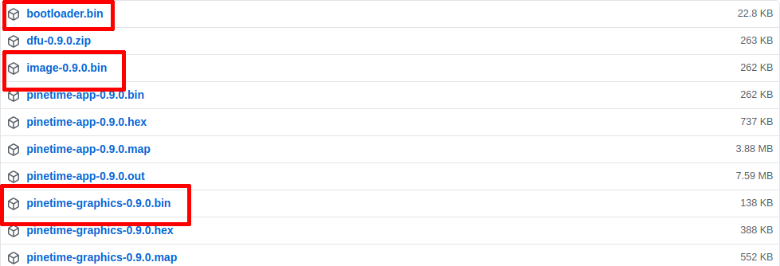

# How to flash InfiniTime using the SWD interface

Download the files **bootloader.bin**, **image-x.y.z.bin** and **pinetime-graphics-x.y.z.bin** from the release page:

The bootloader reads a boot logo from the external SPI flash memory. The first step consists of flashing a tool in the MCU that will flash the boot logo into this SPI flash memory. This first step is optional but recommended (the bootloader will display garbage on screen for a few second if you don't do it).
Using your SWD tool, flash **pinetime-graphics-x.y.z.bin** at offset **0x0000**. Reset the MCU and wait for a few seconds until the logo is completely drawn on the display.

Then, using your SWD tool, flash these file at the following offsets:

- bootloader.bin : **0x0000**
- image-x.y.z.bin : **0x8000**

Reset and voilà, you're running InfiniTime on your PineTime!
