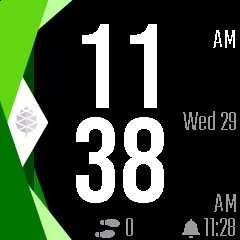
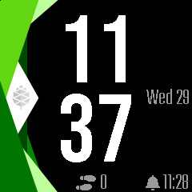
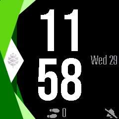
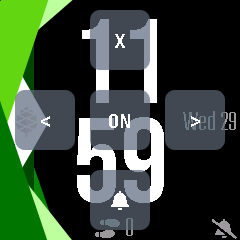

# [InfiniTime : show alarm status on infineat watchface](https://github.com/Eve1374/InfiniTime/tree/alarm-status-on-infineat)
- I forked from [InfiniTime](https://github.com/InfiniTimeOrg/InfiniTime) and added a branch alarm-status-on-infineat
- I modified the watchface settings to have the possibility to show alarm status on watchface

Here are pictures with alarm set in 12 and 24hrs format :

Alarm not set :

Settings view :

## Possible further development :
- Move this setting to the Alarm app and include alarm display in all watchfaces ?

