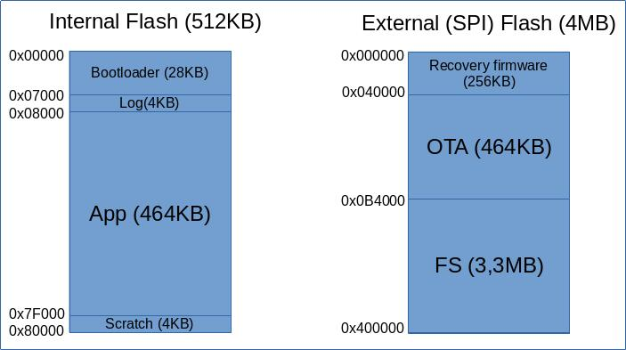

# Bootloader, OTA and recovery on the PineTime

Like most "smart" devices these days, the PineTime is designed to support OTA update : the update of the firmware **O**ver **T**he **Air**, via its Bluetooth Low Energy (BLE) connectivity.

This article describes the design choices behind this feature and how it's implemented in the InfiniTime firmware.

## The theory

During development, developers use specific software and tools to program and debug the firmware running on the device. For example, the nRF52832 (the MCU at the heart of the PineTime) supports the SWD debug protocol.
Using a SWD probe (STLinkV2, J-Link, BlackMagicProbe) and tools like OpenOCD, developers can easily load their firmware to the PineTime, debug it, display debug messages and much more.

This procedure is fine during development but it's obviously not suitable for the end users. As the PineTime does not provide any wired connectivity, the only possible way to update the firmware is via the BLE connection  : the new version of the firmware is transfered *over the air* from a computer or smartphone to the watch.

A lot of precautions must be taken when designing and implementing the OTA procedure to prevent any (un)expected error from crashing and bricking the watch : the data transfer could fail due to loss of connectivity, the data could get corrupted during the transfer, a non-functional firmware could be uploaded,... The update procedure must be able to handle all those degraded cases!

The keywords here are *bootloader*, *BLE Stack* and *application firmware* :

- A *bootloader* is a smaller firmware that is run when the device is started. Its most common tasks are to initialize the hardware and load the actual firmware. It can also be involved in the firmware update procedure.
- A *BLE Stack* is a software library that implements the software functionalities needed to support BLE.
- Finally, the *application firmware* is the actual firmware like InfiniTime.

## The design

Our goals when we designed the bootloader and the OTA procedure for the PineTime were:

- to support multiple application firmwares;
- to give as much freedom to firmware developers as possible;
- to be as safe and reliable as possible.

When designing the OTA procedure for the PineTime, we basically had 2 options : implement the OTA procedure in the bootloader or in the application firmware.

Using the bootloader to handle the OTA is tempting as this would allow to implement it only once, and the application firmware would not need to care about it. However, the downside is that the bootloader would need to integrate the whole BLE stack.

Indeed, the BLE stack is quite heavy in flash memory and a lot of memory would be waster if both the bootloader **and** the application firmware would integrate their own BLE stack. Of course, both the bootloader and the application firmware could share the same stack, but that's against our "freedom to the developers" goal : firmware developer would be forced to use whatever BLE stack we used in the bootloader.

You've probably guessed it, we chose the 2nd solution, and we decided to implement the OTA procedure in the application firmware. In this case, the bootloader is much simpler, and firmware developers have a lot more freedom in their design choices (like the BLE stack to integrate, the data transfer protocol to implement,...).

Here is basically how it works:

- the application firmware exposes a BLE "firmware update" service. In InfiniTime we decided to implement the **nRF DFU** protocol.
- this update service stores the new firmware in a temporary location in the *external flash memory* and checks the integrity of the data (CRC).
- when the new firmware is completely transferred and checked, the watch is rebooted and the bootloader is ran again. The bootloader detects that a new firmware is available in the *external* flash memory and safely swaps the current firmware in the *internal* memory with the new one from the *external* memory.
- When the swapping is done and checked, the new firmware is executed from the *internal* memory.
- If the new firmware does not properly run, the bootloader will automatically revert to the older firmware by swapping again firmwares from the external to the internal memory.

This procedure involves multiple software modules and rely on some hardware features. Let's go into more details!

### Memory map

Multiple memories are available in the PineTime : the internal RAM (64KB) and flash (512KB) memories from the nRF52832 and an external flash memory (4MB) connected to the SPI bus.

RAM memory is not relevant here. Here is how we organized both flash memories:

The internal flash memory contains the bootloader, a log segment (not used), the application firmware and a scratch area. This area is used by the bootloader when *swapping* firmware from the external memory.

The SPI flash memory contains a recovery firmware and an area big enough to store a whole firmware (the new firmware will be first written to this area before being swapped into the internal memory). The remaining space is available for the application firmware needs.

### The bootloader
[The bootloader](https://github.com/InfiniTimeOrg/pinetime-mcuboot-bootloader) is based on [MCUBoot, a secure bootloader for 32 bits microcontrollers](https://github.com/mcu-tools/mcuboot). It was originally written by [Lup Yuen](https://github.com/lupyuen).

MCUBoot is run at boot time. In normal operation, it just jumps to the reset handler of the application firmware to run it. Once the application firmware is running, MCUBoot does not run at all.

But MCUBoot does much more than that : it can upgrade the firmware that is currently running by a new one, and it is also able to revert to the previous version of the firmware in case the new one does not run properly.

To do this, it uses 2 memory 'slots' :
- **The primary slot** (located in the internal flash memory of the nRF52832) : it contains the current firmware, the one that will be executed by MCUBoot
- **The secondary slot** (located in the external SPI flash memory) : it is used to store the upgraded version of the firmware, when available.

At boot time, MCUBoot detects that a new version of the firmware is available in the secondary slot and swaps them : the current version of the firmware is copied from the primary to the secondary slot and vice-versa.

When the swapping is done, it runs the new version of the firmware from the primary slot.

The next time MCUBoot will be run (after an MCU reset), MCUBoot will check if the new firmware ran correctly (it must set a flag in memory). If it is not the case, it'll revert to the previous version of the firmware by copying it from the secondary to the primary.

You'll find more information about MCUBoot, its design and how it works in [the documentation of the project](https://docs.mcuboot.com/).

The [pinetime-mcuboot-bootloader](https://github.com/InfiniTimeOrg/pinetime-mcuboot-bootloader) integrates MCUBoot, provides low-level drivers for the display and SPI flash memory and implements a very basic UI. See [the documentation of the project for more details about this](https://github.com/InfiniTimeOrg/pinetime-mcuboot-bootloader#boot-flow).

An application firmware must implement the following functionalities to be compatible with our bootloader:

- The application firmware will be flashed at **address 0x8000 of the internal flash**. It must then be **linked** with a start address of 0x8000 (instead of 0x00 by default).
- The bootloader starts the **watchdog** just before loading the application firmware. The application firmware must **refresh the watchdog regularly**. If the watchdog is not refreshed in time, the microcontroller will reset, and the bootloader will consider the firmware as unfunctional and will revert to the previous one.
- The application firmware must implement an **OTA procedure which copies the new firmware at offset 0x040000 of the external SPI flash memory**.
- The application firmware must set the valid bit in flash memory (write `1` at offset 0x7BFE8 of the internal flash memory) to validate the installation. If this bit is not set, the bootloader will revert to the previous version at next reset.

Those are basically the only constraints imposed on developers. They are free to use any language, framework, build system, BLE stack and communication protocol, as long as they implement those functionalities.

### Recovery firmware

Together with the bootloader, we also built a [recovery firmware](https://github.com/InfiniTimeOrg/pinetime-mcuboot-bootloader#recovery-firmware). This firmware, which implements the bare minimum to support the OTA procedure (basic UI, BLE stack and DFU protocol) can be used in last resort, in case the application firmware does not run at all, or does not support the OTA procedure.

### Degraded cases

This chapter describes how this design handles degraded cases.

Degraded case | How it's handled
-----|-------------------------------------------------------------------
Data got corrupted during file transfer | Application firmware does a CRC check before applying the update, and does not proceed if it fails.
New firmware does not run at all (bad file) | MCU executes random instructions and will most likely end up in an infinite loop or freeze in an error handler. The watchdog will reset the MCU after ~7s because the firmware does not refresh it. Bootloader reverts to the previous version of the firmware after reset.
New firmware runs, does not set the valid bit and does not refresh the watchdog | The watchdog reset the MCU after ~7s and the bootloader reverts to the previous firmware.
New firmware does not run properly, does not set the valid bit but refreshes the watchdog | Reset the watch if the application firmware provides any way to trigger a softreset. If not, wait for the battery to drain completely before charging the watch again. The bootloader will revert the firmware as soon as the watch is powered again.
New firmware does not run properly but sets the valid bit and refreshes the watchdog | Reset the watch, or drain the battery and load the recovery firmware when the bootloader is running again.

