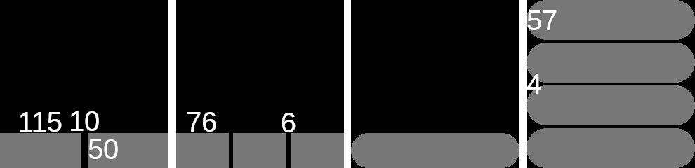

# UI design guidelines

- Align objects all the way to the edge or corner
- Buttons should generally be at least 50px high
- Buttons should generally be on the bottom edge
- Make interactable objects **big**
- When using a page indicator, leave 8px for it on the right side
  - It is acceptable to leave 8px on the left side as well to center the content
- Top bar takes at least 20px + padding
  - Top bar right icons move 8px to the left when using a page indicator
- A black background helps to hide the screen border, allowing the UI to look less cramped when utilizing the entire display area.
- A switch should be twice as wide as it is tall.

