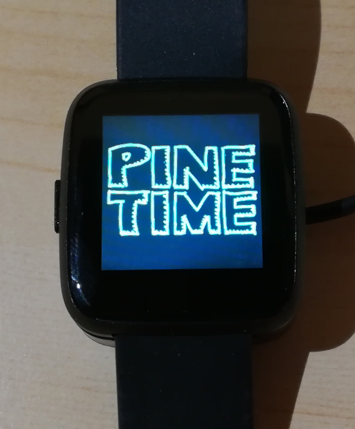
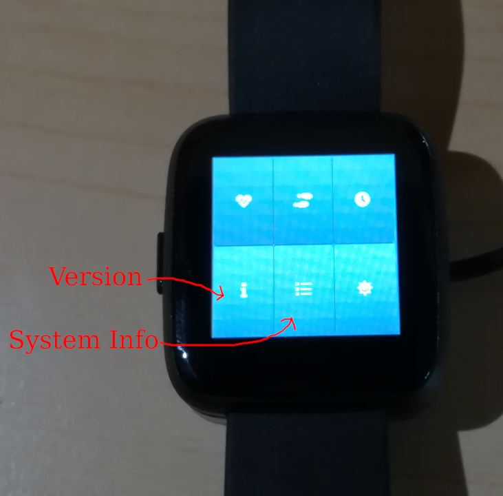
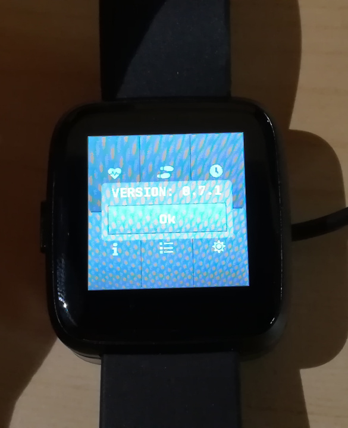
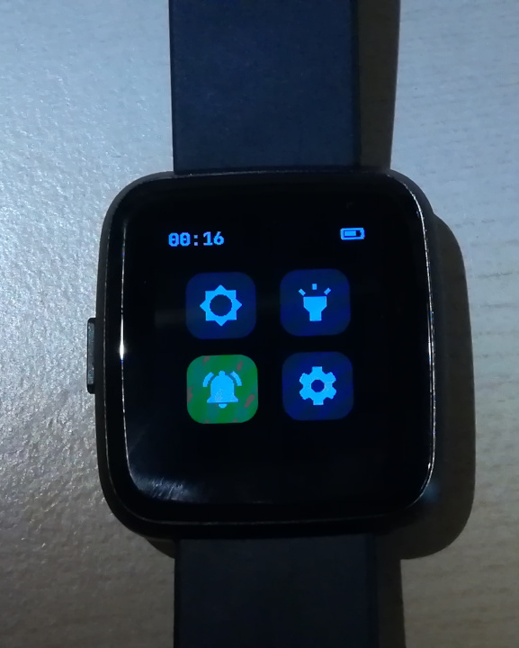
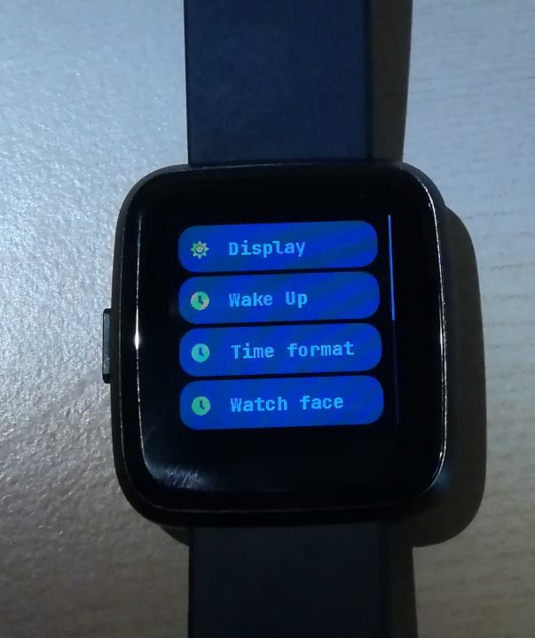
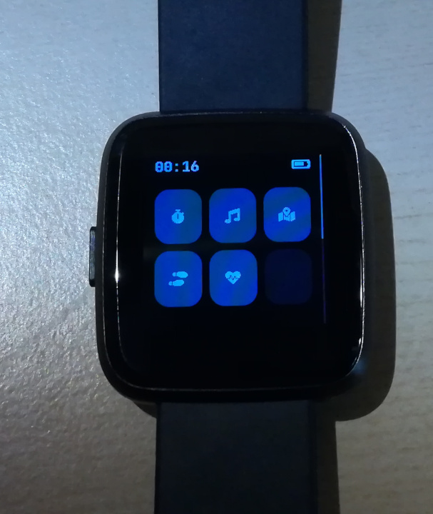

# Getting started with InfiniTime 1.0

On April 22 2021, InfiniTime and Pine64 [announced the release of InfiniTime 1.0](https://www.pine64.org/2021/04/22/its-time-infinitime-1-0/) and the availability of PineTime smartwatches as *enthusiast grade end-user product*. This page aims to guide you with your first step with your new PineTime.

## Firmware, InfiniTime, Bootloader, Recovery firmware, OTA, DFU... What is it?

You might have already seen these words by reading the announcement, release notes, or [the wiki guide](https://wiki.pine64.org/wiki/Upgrade_PineTime_to_InfiniTime_1.0.0) and, you may find them misleading if you're not familiar with the project.

Basically, a **firmware** is just a software running on the embedded hardware of a device, the PineTime in this case.
**InfiniTime** is based on 3 distinct **firmwares**:
 - **[InfiniTime](https://github.com/JF002/InfiniTime)** itself, this is the *application firmware* running on the PineTime. This is the main firmware which provides most of the functionalities you'll use on a daily basis : bluetooth low-energy (BLE) connectivity, applications, watchfaces,...
 - **[The bootloader](https://github.com/JF002/pinetime-mcuboot-bootloader)** is responsible for safely applying **updates** of the *application firmware*, reverting them in case of issues and load the recovery firmware when requested.
 - **The recovery firmware** is a specific *application firmware* than can be loaded by the bootloader on user request. This firmware can be useful in case of serious issue, when the main application firmware cannot perform an OTA update correctly. Currently, this  recovery firmware is based on [InfiniTime 0.14.1](https://github.com/JF002/InfiniTime/releases/tag/0.14.1).

**OTA** and **DFU** refer to the update of the firmware over BLE (**B**luetooth **L**ow **E**nergy). **OTA** means **O**ver **T**he **A**ir, this is a functionality that allows the user to update the firmware how their device using a wireless communication like BLE. When we talk about **DFU** (**D**igital **F**irmware **U**pdate), we refer to the file format and protocol used to send the update of the firmware to the watch over-the-air. InfiniTime implement the (legacy) DFU protocol from Nordic Semiconductor (NRF).

## How to check the version of InfiniTime and the bootloader?

Since September 2020, all PineTimes (devkits or sealed) are flashed using the **[first iteration of the bootloader](https://github.com/lupyuen/pinetime-rust-mynewt/releases/tag/v4.1.7)** and **[InfiniTime 0.7.1](https://github.com/JF002/InfiniTime/releases/tag/0.7.1)**. There was no recovery firmware at that time.

The bootloader only runs when the watch starts (from an empty battery, for example) or after a reset (after a successful OTA or a manual reset - long push on the button).

You can recognize this first iteration of the bootloader with it greenish **PINETIME** logo.

You can check the version of InfiniTime by opening the app *SystemInfo*. For version < 1.0:

And for version >= 1.0 :

PineTime shipped from June 2021 (to be confirmed) will be flashed with the [new version of the bootloader](https://github.com/JF002/pinetime-mcuboot-bootloader/releases/tag/1.0.0), the [recovery firmware](https://github.com/JF002/InfiniTime/releases/tag/0.14.1) and [InfiniTime 1.0](https://github.com/JF002/InfiniTime/releases/tag/1.0.0).

The bootloader is easily recognizable with it white pine cone that is progressively drawn in green. It also displays its own version on the bottom (1.0.0 as of now).

## How to update your PineTime?

To update your PineTime, you can use one of the compatible companion applications. Here are the main ones:

 - **[Amazfish](https://github.com/piggz/harbour-amazfish)** (Desktop Linux, mobile Linux, SailfishOS, runs on the PinebookPro and the Pinephone)
 - **[Gadgetbridge](https://www.gadgetbridge.org/)** (Android)
 - **[Siglo](https://github.com/alexr4535/siglo)** (Linux, GTK based)
 - **NRFConnect** (closed source, Android & iOS).

See [this page](ota-gadgetbridge-nrfconnect.md) for more info about the OTA procedure using Gadgetbridge and NRFConnect.

### From InfiniTime 0.7.1 / old bootloader

If your PineTime is currently running InfiniTime 0.7.1 and the old bootloader, we strongly recommend you update them to more recent version (Bootloader 1.0.0 and InfiniTime 1.0.0 as of now). We also recommend you install the recovery firmware once the bootloader is up-do-date.

Using the companion app of your choice, you'll need to apply the OTA procedure for these 3 firmwares in this sequence (failing to follow this specific order might temporarily or permanently brick your device):

 1. Flash the latest version of InfiniTime. The file to upload is named **pinetime-mcuboot-app-dfu-x.y.z.zip**. Here is the link to [InfiniTime 1.0](https://github.com/JF002/InfiniTime/releases/download/1.0.0/pinetime-mcuboot-app-dfu-1.0.0.zip).
 2. Update the bootloader by applying the OTA procedure with the file named [**reloader-mcuboot.zip** from the repo of the bootloader](https://github.com/JF002/pinetime-mcuboot-bootloader/releases/download/1.0.0/reloader-mcuboot.zip).
 3. Install the recovery firmware by applying the OTA procedure with the file named [**pinetime-mcuboot-recovery-loader-dfu-0.14.1.zip** from the version 0.14.1 of InfiniTime](https://github.com/JF002/InfiniTime/releases/download/0.14.1/pinetime-mcuboot-recovery-loader-dfu-0.14.1.zip).

You'll find more info about this process in [this wiki page](https://wiki.pine64.org/wiki/Upgrade_PineTime_to_InfiniTime_1.0.0). You can also see the procedure in video [here](https://video.codingfield.com/videos/watch/831077c5-16f3-47b4-9b2b-c4bbfecc6529) and [here (from Amazfish)](https://video.codingfield.com/videos/watch/f7bffb3d-a6a1-43c4-8f01-f4aeff4adf9e)

### From version > 1.0

If you are already running the new "1.0.0" bootloader, all you have to do is update your version of InfiniTime when it'll be available. We'll write specific instructions when (if) we release a new version of the bootloader.

### Firmware validation

The bootloader requires a (manual) validation of the firmware. If the watch reset with an updated firmware that was not validated, the bootloader will consider it as non-functioning and will revert to the previous version of the firmware. This is a safety feature to prevent bricking your device with a faulty firmware.

You can validate your updated firmware on InfiniTime >= 1.0 by following this simple procedure:

 - From the watchface, swipe **right** to display the *Quick Actions menu*
 - Open the **Settings** app by tapping the *gear* icon on the bottom right
 - Swipe down and tap on the entry named **Firmware**
 - This app shows the version that is currently running. If it's not validated yet, it displays 2 buttons:
    - **Validate** to validate your firmware
    - **Reset** to reset the watch and revert to the previously running version of the firmware

## InfiniTime 1.0 quick user guide

### Setting the time

By default, InfiniTime starts on the digital watchface. It'll probably display the epoch time (1 Jan 1970, 00:00). The time will be automatically synchronized once you connect on of the companion app to your PineTime using BLE connectivity. InfiniTime does not provide any way to manually set the time for now.

### Navigation in the menu

 - Swipe **down** to display the notification panel. Notification sent by your companion app will be displayed in this panel.
 - Swipe **up** to display the application menus. Apps (stopwatch, music, step, games,...) can be started from this menu.
 - Swipe **right** to display the Quick Actions menu. This menu allows you to
    - Set the brightness of the display
    - Start the **flashlight** app
    - Enable/disable vibrations on notifications (Do Not Disturb mode)
    - Enter the **settings** menu
 - Settings
    - Display timeout
    - Wake up event (Tap, wrist rotation)
    - Time format (12/24H)
    - Default watchface (digital / analog)
    - Battery info
    - Firmware validation
    - About (system info, firmware version,...)

### Bootloader

Most of the time, the bootloader just runs without your intervention (update and load the firmware).

However, you can enable 2 functionalities using the push button:

 - Push the button until the pine cone is drawn in **blue** to force the rollback of the previous version of the firmware, even if you've already validated the updated one
 - Push the button until the pine cone is drawn in **red** to load the recovery firmware. This recovery firmware only provides BLE connectivity and OTA functionality.

More info about the bootloader in [its project page](https://github.com/JF002/pinetime-mcuboot-bootloader/blob/master/README.md).
