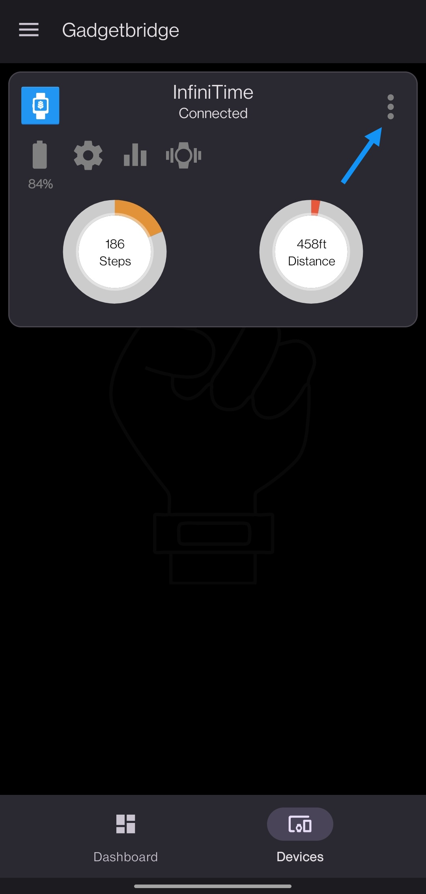

# Flash and upgrade InfiniTime
If you just want to flash or upgrade InfiniTime on your PineTime, this page is for you!

- [InfiniTime releases and versions](#infinitime-releases-and-versions)
- [How to upgrade Over-The-Air (OTA)](#how-to-upgrade-over-the-air-ota)
    - [Using Gadgetbridge](#using-gadgetbridge)
    - [Using NRFConnect](#Using-nrfconnect)
- [How to flash InfiniTime using the SWD interface](#how-to-flash-infinitime-using-the-swd-interface)

## InfiniTime releases and versions
All releases of InfiniTime are available on the [release page of the GitHub repo](https://github.com/JF002/InfiniTime/releases).

Versions that are tagged as **RELEASE CANDIDATE** are pre-release versions, that are available for testing before actually releasing a new stable version. If you want to help us debug the project and provide stable versions to other user, you can use them. If you want stable and tested version, you should not flash these release candidate version.

Release files are available under the *Assets* button.

## How to upgrade Over-The-Air (OTA)
OTA is the easiest method to upgrade InfiniTime. Note that it's only possible is your PineTime is already running InfiniTime (>= 0.7.1).

2 companion apps provide support for OTA : 
 - [Gadgetbridge](https://gadgetbridge.org/) (open source, runs on Android, [available on F-Droid](https://f-droid.org/packages/nodomain.freeyourgadget.gadgetbridge/)). 
 - [NRFConnect](https://www.nordicsemi.com/Software-and-tools/Development-Tools/nRF-Connect-for-mobile) (close source, runs on Android and iOS).
 
Both applications need you to download the **DFU file** of InfiniTime. This file contains the new version of InfiniTime that will be flashed into your device. It's called **dfu-x.y.z.zip** (ex: dfu-0.9.0.zip) in the release note.

### Using Gadgetbridge
Launch Gadgetbridge and tap on the **"+"** button on the bottom right to add a new device:

Wait for the scan to complete, your PineTime should be detected:

Tap on it. Gadgdetbridge will pair and connect to your device:

Now that Gadgetbridge is connected to your PineTime, use a file browser application (I'm using Seafile to browse my NAS) and browse to the DFU file (image-xxx.zip) you downloaded previously. Tap on it and open it using the Gadgetbridge application/firmware installer:

Read carefully the warning and tap **Install**:

Wait for the transfer to finish. Your PineTime should reset and reboot with the new version of InfiniTime!

Don't forget to **validate** your firmware. In the InfiniTime go to the settings (swipe right, select gear icon) and Firmware option and click **validate**. Otherwise after reboot the previous firmware will be used.

### Using NRFConnect
Open NRFConnect. Swipe down in the *Scanner* tab and wait for your device to appear:

Tap on the *Connect* button on the right of your device. NRFConnect will connect to your PineTime and discover its characteristics. Tap on the **DFU** button on the top right:

Select **Distribution packet (ZIP)**:

Browse to the DFU file you downloaded previously, the DFU transfer will start automatically. When the transfer is finished, your PineTime will reset and restart on the new version of InfiniTime!

Don't forget to **validate** your firmware. In the InfiniTime go to the settings (swipe right, select gear icon) and Firmware option and click **validate**. Otherwise after reboot the previous firmware will be used.

## How to flash InfiniTime using the SWD interface
Download the files **bootloader.bin**, **image-x.y.z.bin** and **pinetime-graphics-x.y.z.bin** from the release page:

The bootloader reads a boot logo from the external SPI flash memory. The first step consists in flashing a tool in the MCU that will flash the boot logo into this SPI flash memory. This first step is optional but recommanded (the bootloader will display garbage on screen for a few second if you don't do it).
Using your SWD tool, flash **pinetime-graphics-x.y.z.bin** at offset **0x0000**. Reset the MCU and wait for a few second, until the logo is completely drawn on the display.

Then, using your SWD tool, flash those file at specific offset:

 - bootloader.bin : **0x0000**
 - image-x.y.z.bin : **0x8000**

Reset and voilà, you're running InfiniTime on your PineTime!
 
If you are using OpenOCD with a STLinkV2, you can find more info [on this page](../openOCD.md).

## How to synchronize the time

### Using Gadgetbridge
Good news! Gadgetbridge **automatically** synchronizes the time when connecting to your PineTime!

### Using any Chromium-based web browser
You can use it from your PC, Mac, Android. Browsers now have BLE support.
https://hubmartin.github.io/WebBLEWatch/

### Using NRFConnect
You must enable the **CTS** *GATT server* into NRFConnect so that InfiniTime can synchronize the time with your smartphone.

Launch NRFConnect, tap the sandwich button on the top left and select *Configure GATT server*:

Tap *Add service* and select the server configuration *Current Time service*. Tap OK and connect to your PineTime, it should automcatically sync the time once the connection is established!

