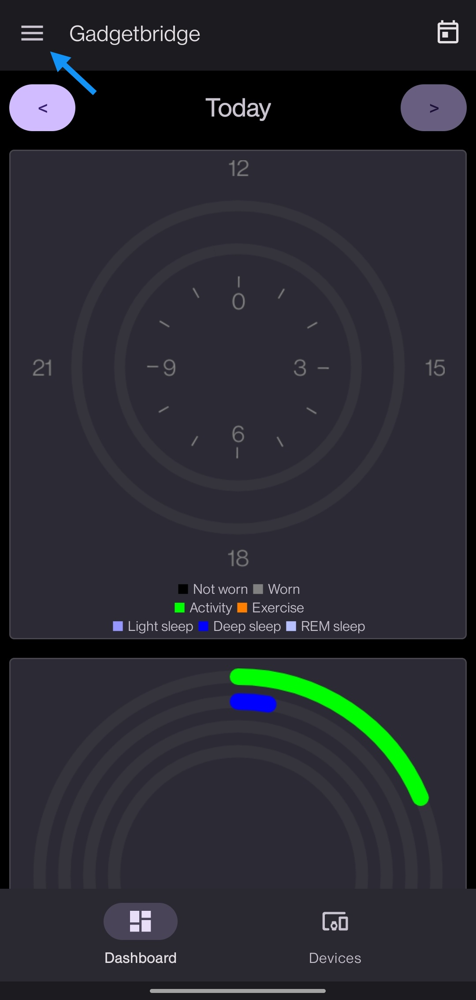
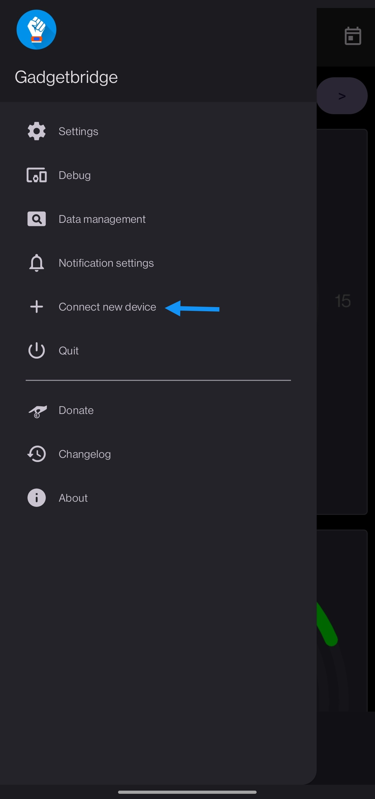

# Connecting to Gadgetbridge

Launch Gadgetbridge and tap on the **"+"** button on the bottom right to add a new device:

Wait for the scan to complete, your PineTime should be detected:

Tap on it. Gadgdetbridge will pair and connect to your device:

# Updating with Gadgetbridge

Now that Gadgetbridge is connected to your PineTime, use a file browser application and find the DFU file (`pinetime-mcuboot-app-dfu-x.x.x.zip`) you downloaded previously. Tap on it and open it using the Gadgetbridge application/firmware installer:

Read the warning carefully and tap **Install**:

Wait for the transfer to finish. Your PineTime should reset and reboot with the new version of InfiniTime!

Don't forget to **validate** your firmware. In the InfiniTime go to the settings (swipe right, select gear icon) and Firmware option and click **validate**. Otherwise after reboot the previous firmware will be used.

