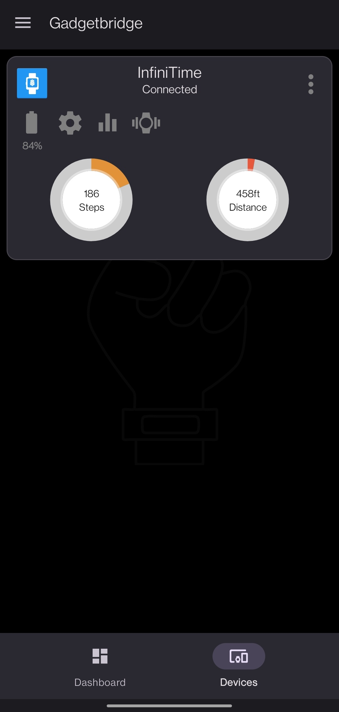
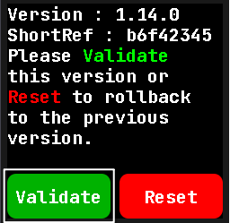

# Connecting to Gadgetbridge

Launch Gadgetbridge and tap on the menu button in the top left:

Press the "Connect new device" button:

Your PineTime should appear on the list. Tap on it.

Tap on it. Gadgdetbridge will pair and connect to your device:

# Updating with Gadgetbridge

Now that Gadgetbridge is connected to your PineTime, press the three dots on the device card:

Now press the "File Installer" button:

Select the firmware you downloaded (`pinetime-mcuboot-app-dfu-x.x.x.zip`) from the [Releases tab](https://github.com/InfiniTimeOrg/InfiniTime/releases/latest):

Wait for the transfer to finish. There will be a progress bar on both the watch and the phone. Your PineTime should reboot with the new version of InfiniTime!

Don't forget to **validate** your firmware. In the InfiniTime go to the settings (swipe right, select gear icon) and scroll to the Firmware option and click **validate**. Otherwise, after reboot the previous firmware will be used.

