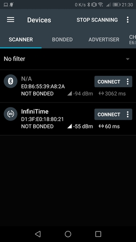
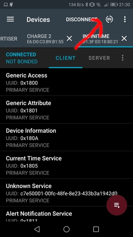
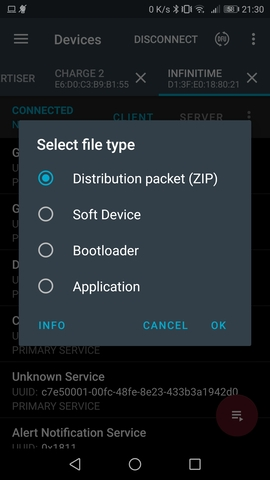
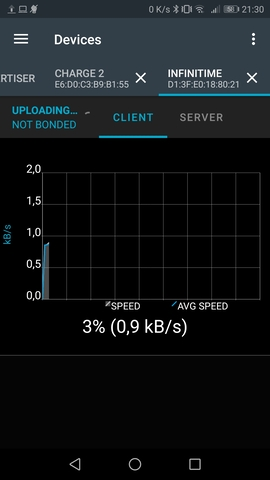

# Updating with NRFConnect

Open NRFConnect. Swipe down in the *Scanner* tab and wait for your device to appear:

Tap on the *Connect* button on the right of your device. NRFConnect will connect to your PineTime and discover its characteristics. Tap on the **DFU** button on the top right:

Select **Distribution packet (ZIP)**:

Find the DFU file (`pinetime-mcuboot-app-dfu-x.x.x.zip`) you downloaded previously, the DFU transfer will start automatically. When the transfer is finished, your PineTime will reset and restart on the new version of InfiniTime!

Don't forget to **validate** your firmware. In the InfiniTime go to the settings (swipe right, select gear icon) and Firmware option and click **validate**. Otherwise after reboot the previous firmware will be used.

# Demo

[This video](https://seafile.codingfield.com/f/a52b69683a05472a90c7/) shows how to use NRFConnect to update the firmware running on the Pinetime.
