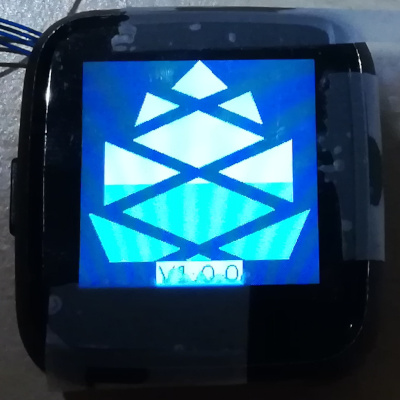

## Firmware, InfiniTime, Bootloader, Recovery firmware, OTA, DFU... What is it?

You might have already seen these words by reading the announcement, release notes, or [the wiki guide](https://wiki.pine64.org/wiki/Upgrade_PineTime_to_InfiniTime_1.0.0) and, you may find them confusing if you're not familiar with the project.

Basically, a **firmware** is just a software running on the embedded hardware of a device, the PineTime in this case.
**InfiniTime OS** is based on 3 distinct **firmwares**:
 - **[InfiniTime](https://github.com/InfiniTimeOrg/InfiniTime)** itself, this is the *application firmware* running on the PineTime. This is the main firmware which provides most of the functionalities you'll use on a daily basis : bluetooth low-energy (BLE) connectivity, applications, watchfaces,...
 - **[The bootloader](https://github.com/JF002/pinetime-mcuboot-bootloader)** is responsible for safely applying **updates** of the *application firmware*, reverting them in case of issues and load the recovery firmware when requested.
 - **The recovery firmware** is a specific *application firmware* than can be loaded by the bootloader on user request. This firmware can be useful in case of serious issue, when the main application firmware cannot perform an OTA update correctly. Currently, this  recovery firmware is based on [InfiniTime 0.14.1](https://github.com/InfiniTimeOrg/InfiniTime/releases/tag/0.14.1).

**OTA** and **DFU** refer to the update of the firmware over BLE (**B**luetooth **L**ow **E**nergy). **OTA** means **O**ver **T**he **A**ir, this is a functionality that allows the user to update the firmware how their device using a wireless communication like BLE. When we talk about **DFU** (**D**evice **F**irmware **U**pdate), we refer to the file format and protocol used to send the update of the firmware to the watch over-the-air. InfiniTime implement the (legacy) DFU protocol from Nordic Semiconductor (NRF).

## How to check the version of InfiniTime and the bootloader?

You can check the InfiniTime version by first swiping right on the watchface to open quick settings, tapping the cogwheel to open settings, swipe up until you find an entry named "About" and tap on it.

PineTimes shipped after June 2021 will be flashed with the [new version of the bootloader](https://github.com/JF002/pinetime-mcuboot-bootloader/releases/tag/1.0.0), the [recovery firmware](https://github.com/InfiniTimeOrg/InfiniTime/releases/tag/0.14.1) and [InfiniTime 1.0](https://github.com/InfiniTimeOrg/InfiniTime/releases/tag/1.0.0).

The bootloader only runs when the watch starts (from an empty battery, for example) or after a reset (after a successful OTA or a manual reset - long push on the button).

The bootloader is easily recognizable with its white pine cone that is progressively drawn in green. It also displays its own version on the bottom (1.0.0 as of now).

## How to update your PineTime?

To update your PineTime, you can use one of the compatible companion applications.

The updating process differs slightly on every companion app, so you'll need to familiarize yourself with the companion app of your choice.

All releases of InfiniTime are available on the [release page of the GitHub repo](https://github.com/InfiniTimeOrg/InfiniTime/releases).

Release files are available under the *Assets* button.

To update the firmware, you need to download the DFU of the firmware version that you'd like to install, for example `pinetime-mcuboot-app-dfu-1.6.0.zip`, and flash it with your companion app.

We have prepared instructions for flashing InfiniTime with Gadgetbridge and NRFConnect.

 - [Updating with Gadgetbridge](/doc/gettingStarted/ota-gadgetbridge.md)
 - [Updating with NRFConnect](/doc/gettingStarted/ota-nrfconnect.md)

### Firmware validation

The bootloader requires a manual validation of the firmware. If the watch reset with an updated firmware that was not validated, the bootloader will consider it as non-functioning and will revert to the previous version of the firmware. This is a safety feature to prevent bricking your device with a faulty firmware.

You can validate your updated firmware on InfiniTime >= 1.0 by following this simple procedure:

 - From the watchface, swipe **right** to display the *quick settings menu*
 - Open settings by tapping the cogwheel on the bottom right
 - Swipe up until you find an entry named **Firmware** and tap on it
 - This app shows the version that is currently running. If the firmware is not validated yet, you can either validate the running firmware, or reset and revert to the previous firmware version

## Bootloader

Most of the time, the bootloader just runs without your intervention (update and load the firmware).

However, you can enable 2 functionalities using the push button:

 - Push the button until the pine cone is drawn in **blue** to force the rollback of the previous version of the firmware, even if you've already validated the updated one
 - Push the button until the pine cone is drawn in **red** to load the recovery firmware. This recovery firmware only provides BLE connectivity and OTA functionality.

More info about the bootloader in [its project page](https://github.com/JF002/pinetime-mcuboot-bootloader/blob/master/README.md).
