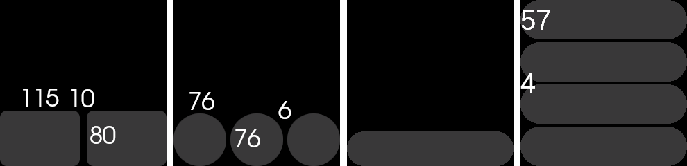

# UI design guidelines

- Align objects all the way to the edge or corner
- Buttons should generally be at least 50px high
- Buttons should generally be on the bottom edge
- Make interactable objects **big**
- Recommendations for inner padding, aka distance between buttons:
	- When aligning 4 objects: 4px, e.g. Settings
	- When aligning 3 objects: 6px, e.g. App list
	- When aligning 2 objects: 10px, e.g. Quick settings
- When using a page indicator, leave 8px for it on the right side
	- It is acceptable to leave 8px on the left side as well to center the content
- Top bar takes at least 20px + padding
	- Top bar right icons move 8px to the left when using a page indicator

