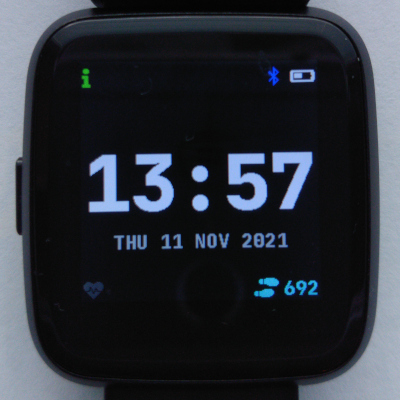
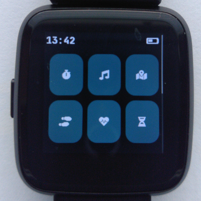
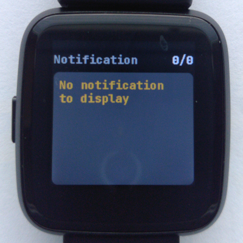
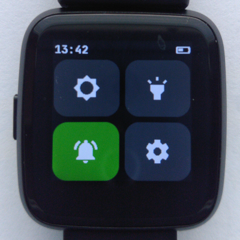
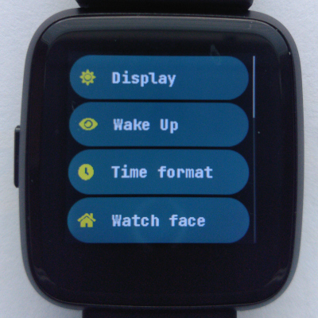

# Getting started with InfiniTime

On April 22, 2021, InfiniTime and Pine64 [announced the release of InfiniTime 1.0.0](https://www.pine64.org/2021/04/22/its-time-infinitime-1-0/) and the availability of PineTime smartwatches as an *enthusiast grade end-user product*. This page aims to guide you with your first step with your new PineTime.

It is highly recommended to update the firmware to the latest version when you receive your watch and when a new InfiniTime version is released. More information on updating the firmware [here](/doc/gettingStarted/updating-software.md).

## InfiniTime quick user guide

### Setting the time

By default, InfiniTime starts on the digital watch face. It'll probably display the epoch time (1 Jan 1970, 00:00).

You can sync the time using companion apps.

- Gadgetbridge automatically synchronizes the time when you connect it to your watch. More information on Gadgetbridge [here](/doc/gettingStarted/ota-gadgetbridge.md)
- [Sync the time with NRFConnect](/doc/gettingStarted/time-nrfconnect.md)
- Sync the time with your browser https://hubmartin.github.io/WebBLEWatch/

You can also set the time in the settings without a companion app. (version >1.7.0)

InfiniTime doesn't handle daylight savings automatically, so make sure to set the correct time or sync it with a companion app.

### Digital watch face

This is what the default digital watch face looks like. You can change watch faces in the settings.

The indicator on the top left is visible if you have unread notifications

On the top right, there are status icons

- The battery icon shows roughly how much charge is remaining
- The Bluetooth icon is visible when the watch is connected to a companion app
- A plug icon is shown when the watch is plugged into a charger.

On the bottom left, you can see your heart rate if you have the measurement enabled in the heart rate app.

On the bottom right, you can see how many steps you have taken today.

### Navigation in the menu

- Swipe **up** to display the application menus. Apps (stopwatch, music, step, games,...) can be started from this menu.
- Swipe **down** to display the notification panel. Notification sent by your companion app will be displayed here.
- Swipe **right** to display the Quick Actions menu. This menu allows you to
  - Set the brightness of the display
  - Start the **flashlight** app
  - Enable/disable notifications (Do Not Disturb mode)
  - Enter the **settings** menu
    - Swipe up and down to see all options
- Click the button to go back a screen.
- You can hold the button for a short time to return to the watch face. (version >1.7.0)
