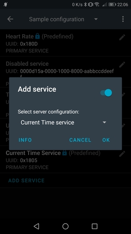

### Syncing time

You must enable the **CTS** *GATT server* in NRFConnect so that InfiniTime can synchronize the time with your smartphone.

Launch NRFConnect, tap the sandwich button on the top left and select *Configure GATT server*:

Tap *Add service* and select the server configuration *Current Time service*. Tap OK and connect to your PineTime, it should automcatically sync the time once the connection is established!

