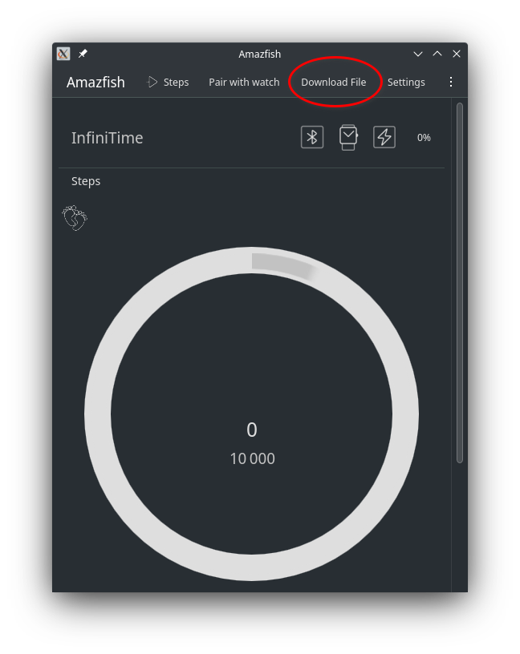
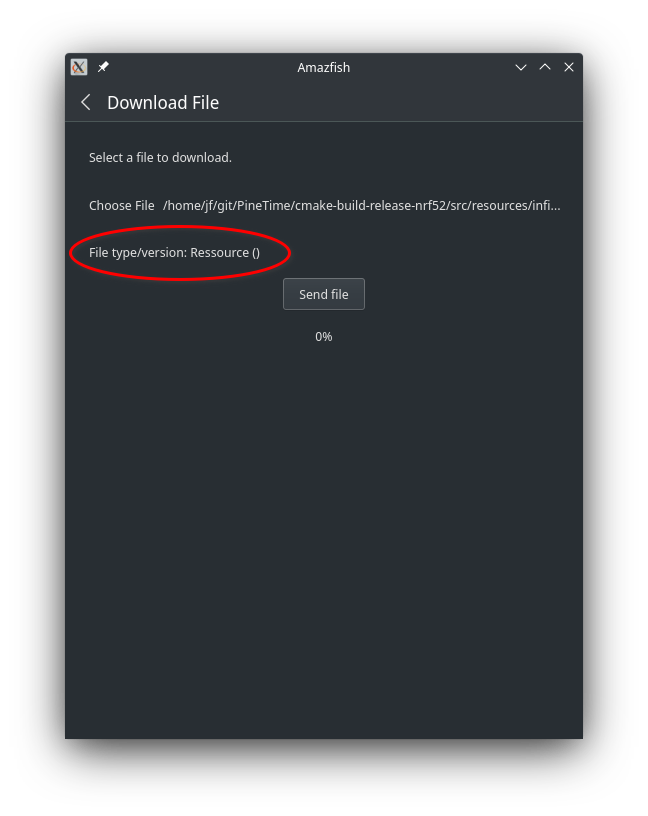
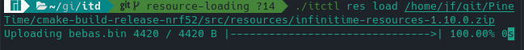

# Updating InfiniTime

If you just want to flash or upgrade InfiniTime on your PineTime, this page is for you! If you want more information about the software and the update procedure, check out [this](/doc/gettingStarted/about-software.md) page.

## Checking the version of InfiniTime

You can check the InfiniTime version by first swiping right on the watch face to open quick settings, tapping the cogwheel to open settings, swipe up until you find an entry named "About" and tap on it.


PineTimes shipped after June 2021 will ship with the latest version of [the bootloader](https://github.com/JF002/pinetime-mcuboot-bootloader/releases/tag/1.0.0) and [recovery firmware](https://github.com/InfiniTimeOrg/InfiniTime/releases/tag/0.14.1)

The bootloader is run right before booting into InfiniTime. It is easily recognizable with its white pine cone that is progressively drawn in green. It also displays its own version on the bottom (1.0.0 as of now).


## Updating with companion apps

To update your PineTime, you can use one of the [compatible companion applications](/README.md#companion-apps).

The updating process differs slightly on every companion app, so you'll need to familiarize yourself with the companion app of your choice.

All releases of InfiniTime are available on the [release page of the GitHub repo](https://github.com/InfiniTimeOrg/InfiniTime/releases) under assets.

To update the firmware, you need to download the DFU of the firmware version that you'd like to install, for example `pinetime-mcuboot-app-dfu-1.6.0.zip`, and flash it with your companion app.

We have prepared instructions for flashing InfiniTime with Gadgetbridge and NRFConnect.

- [Updating with Gadgetbridge](/doc/gettingStarted/ota-gadgetbridge.md)
- [Updating with NRFConnect](/doc/gettingStarted/ota-nrfconnect.md)

## Firmware validation

Firmware updates must be manually validated. If the firmware isn't validated and the watch resets, the watch will revert to the previous firmware. This is a safety feature to prevent bricking your device with faulty firmware.

You can validate your updated firmware on InfiniTime >= 1.0 by following this simple procedure:

- From the watch face, swipe **right** to display the *quick settings menu*
- Open settings by tapping the cogwheel on the bottom right
- Swipe up until you find an entry named **Firmware** and tap on it
- If the firmware is not validated yet, you can either validate the running firmware, or reset and revert to the previous firmware version

# Updating resources

Since InfiniTime 1.11 apps and watchfaces can take benefit of the external flash memory to store their pictures and fonts. 
This external memory is a lot bigger (4MB) than the internal memory where the firmware is flashed (512KB). 
Since those resources are not part of the firmware, they need to be flashed and updated separately. 

Resources are packaged into a single .zip file named `infinitime-resources-x.y.z.zip` (where `x`, `y` and `z` are the version numbers of InfiniTime). 
You can use the companion app of your choice to flash the resources.

**Note : at the time of writing this page, [Amazfish](https://github.com/piggz/harbour-amazfish) and [ITD](https://gitea.arsenm.dev/Arsen6331/itd) have already integrated this functionality. Other companion apps will hopefully implement it soon!*

## Amazfish
Use the `Download file` functionality of Amazfish. 



Amazfish automatically detects the file type (firmware or resources) and apply the corresponding flash procedure when you hit the button **Send file**.



## ITD

Run `itctl` with the `res` command:

```
itctl res load infinitime-resources-1.10.0.zip
```

Example:


