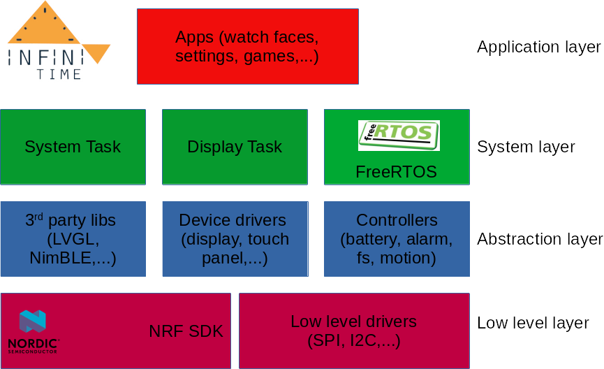

# Developer documentation

## Global architecture



The project is composed of multiple layers:

### The low level layer
The low level layer is composed of mostly hardware dependent software modules : startup code, low level drivers for clocks, busses, peripherals,... 
Most of these modules are provided by the NRF SDK, but some drivers (I2C and SPI, for example) were reimplemented to better fit the needs of the project. 
 
### The abtraction layer
The abstraction layer is composed of components and controllers that abtracts the hardware from the upper layers while providing higher level APIs and services for these layers. 

Those [controllers](https://github.com/InfiniTimeOrg/InfiniTime/tree/develop/src/components) are, among others:
 - The [**battery controller**](https://github.com/InfiniTimeOrg/InfiniTime/blob/develop/src/components/battery/BatteryController.h) that handles the battery level measurements and conversion
 - The [**file system**](https://github.com/InfiniTimeOrg/InfiniTime/blob/develop/src/components/fs/FS.h) that allows the application to easily read and write data to the flash memory
 - The [**motion controller**](https://github.com/InfiniTimeOrg/InfiniTime/blob/develop/src/components/motion/MotionController.h) that provides motion and step information from the motion sensor
 - and many others...

### The system layer
The system layer is composed of the RTOS (FreeRTOS) and the tasks needed for the firmware to run properly. These tasks are mainly the System task and the display task. This layer also implements a message passing mecanism (based on message queues) that allows tasks to exchange messages and events.

#### FreeRTOS
InfiniTime is based on [FreeRTOS](https://www.freertos.org), a real-time operating system. FreeRTOS provides several quality of life abstractions (for example easy software timers) and most importantly supports multiple tasks. If you want to read up on real-time operating systems, you can look
[here](https://www.freertos.org/implementation/a00002.html) and [here](https://www.freertos.org/features.html). The main "process" (the function `main()`)creates at least one task and then starts the FreeRTOS task scheduler. The task scheduler is responsible for giving every task enough cpu time. As
there is only one core on the SoC of the PineTime, real concurrency is impossible and the scheduler has to swap tasks in and out to emulate it.

#### Tasks
Tasks are created by calling `xTaskCreate()` and passing a function with the signature `void functionName(void*)`. For more info on task creation see the [FreeRTOS Documentation](https://www.freertos.org/a00125.html).

**System task**  is the main task of the project. It's responsible for initializing all devices and peripheral at startup, for managing and routing events between the tasks and the controllers, for managing the wake and sleep mode, for responding to external events (button press, touch even),...
It's implement in the class [`PineTime::System::SystemTask`](https://github.com/InfiniTimeOrg/InfiniTime/blob/develop/src/systemtask/SystemTask.h). It provides 2 main methods: `SystemTask::Start()` that starts the task, and `SystemTask::Work()` which is the method the task executes. It starts by initializing all device and peripherals and then enters into its main loop.

**Display task** is implemented in the class [`PineTime::Applications::DisplayApp`](https://github.com/InfiniTimeOrg/InfiniTime/blob/develop/src/displayapp/DisplayApp.h). Similarly to **System task**, it provides the methods `Start()` and `Work()`. Display task handles the whole UI : it responds to touch and button events, it switches between apps, refresh the UI according to user interactions,...

The [BLE stack (NimBLE)](https://github.com/apache/mynewt-nimble) creates [2 other tasks (**ll** and **ble**)](https://github.com/InfiniTimeOrg/InfiniTime/blob/develop/src/libs/mynewt-nimble/porting/npl/freertos/src/nimble_port_freertos.c) to handle the whole BLE processing.

An additional task handles the signal processing for the heart rate monitor : [`PineTime::Applications::HeartRateTask`](https://github.com/InfiniTimeOrg/InfiniTime/blob/develop/src/heartratetask/HeartRateTask.h).

### The application layer
The **application layer** implements the applications visible to the user (watch faces, settings, music application, games,...). 

The UI is based on the [*Light and versatile graphics library (LVGL)*](https://lvgl.io/).
 
## Bluetooth

Header files with short documentation for the functions are inside
[libs/mynewt-nimble/nimble/host/include/host/](/src/libs/mynewt-nimble/nimble/host/include/host/).

## How to implement an app

### Theory

The user interface of InfiniTime is made up of **screens**.
Screens that are opened from the app launcher are considered **apps**.
Every app in InfiniTime is it's own class.
An instance of the class is created when the app is launched and destroyed when
the user exits the app.
They run inside the "displayapp" task (briefly discussed [here](./Intro.md)).
Apps are responsible for everything drawn on the screen when they are running.
By default, apps only do something (as in a function is executed) when they are
created or when a touch event is detected.

### Interface

Every app class has to be inside the namespace `Pinetime::Applications::Screens`
and inherit from `Screen`.
The constructor should have at least one parameter `DisplayApp* app`, which it
needs for the constructor of its parent class Screen.
Other parameters should be references to controllers that the app needs.
A destructor is needed to clean up LVGL and restore any changes (for example
re-enable sleeping).
App classes can override `bool OnButtonPushed()`, `bool OnTouchEvent(TouchEvents
event)` and `bool OnTouchEvent(uint16_t x, uint16_t y)` to implement their own
functionality for those events.
If an app only needs to display some text and do something upon a touch screen
button press,
it does not need to override any of these functions, as LVGL can also handle
touch events for you.
If you have any doubts, you can always look at how the other apps are doing
things.

#### Continuous updating

If your app needs to be updated continuously, you can do so by overriding the
`Refresh()` function in your class and calling `lv_task_create` inside the
constructor.

An example call could look like this:
```cpp
taskRefresh = lv_task_create(RefreshTaskCallback, LV_DISP_DEF_REFR_PERIOD, LV_TASK_PRIO_MID, this);
```

With `taskRefresh` being a member variable of your class and of type
`lv_task_t*`.
Remember to delete the task again using `lv_task_del`.
The function `RefreshTaskCallback` is inherited from `Screen` and just calls
your `Refresh` function.

### Creating your own app

A minimal app could look like this:

MyApp.h:
```cpp
#pragma once

#include "displayapp/screens/Screen.h"
#include <lvgl/lvgl.h>

namespace Pinetime {
  namespace Applications {
    namespace Screens {
      class MyApp : public Screen {
      public:
        MyApp(DisplayApp* app);
        ~MyApp() override;
      };
    }
  }
}
```

MyApp.cpp:
```cpp
#include "displayapp/screens/MyApp.h"
#include "displayapp/DisplayApp.h"

using namespace Pinetime::Applications::Screens;

MyApp::MyApp(DisplayApp* app) : Screen(app) {
  lv_obj_t* title = lv_label_create(lv_scr_act(), nullptr);
  lv_label_set_text_static(title, "My test application");
  lv_label_set_align(title, LV_LABEL_ALIGN_CENTER);
  lv_obj_align(title, lv_scr_act(), LV_ALIGN_CENTER, 0, 0);
}

MyApp::~MyApp() {
  lv_obj_clean(lv_scr_act());
}
```

Both of these files should be in [displayapp/screens/](/src/displayapp/screens/)
or [displayapp/screens/settings/](/src/displayapp/screens/settings/) if it's a
setting app.

Now we have our very own app, but InfiniTime does not know about it yet.
The first step is to include your MyApp.cpp (or any new cpp files for that
matter)
in the compilation by adding it to [CMakeLists.txt](/CMakeLists.txt).
The next step to making it launchable is to give your app an id.
To do this, add an entry in the enum class `Pinetime::Applications::Apps`
([displayapp/Apps.h](/src/displayapp/Apps.h)).
Name this entry after your app. Add `#include "displayapp/screens/MyApp.h"` to
the file [displayapp/DisplayApp.cpp](/src/displayapp/DisplayApp.cpp).
Now, go to the function `DisplayApp::LoadApp` and add another case to the switch
statement.
The case will be the id you gave your app earlier.
If your app needs any additional arguments, this is the place to pass them.

If you want to add your app in the app launcher, add your app in
[displayapp/screens/ApplicationList.cpp](/src/displayapp/screens/ApplicationList.cpp)
to one of the `CreateScreen` functions, or add another `CreateScreen` function
if there are no empty spaces for your app. If your app is a setting, do the same
procedure in
[displayapp/screens/settings/Settings.cpp](/src/displayapp/screens/settings/Settings.cpp).

You should now be able to [build](../buildAndProgram.md) the firmware
and flash it to your PineTime. Yay!

Please remember to pay attention to the [UI guidelines](../ui_guidelines.md)
when designing an app that you want to be included in InfiniTime.

## Generating the fonts and symbols

You can download fonts using the links below:

* [Jetbrains Mono](https://www.jetbrains.com/fr-fr/lp/mono/)
* [Awesome font from LVGL](https://lvgl.io/assets/others/FontAwesome5-Solid+Brands+Regular.woff)
* [Open Sans Light from Google](https://fonts.google.com/specimen/Open+Sans)

### Generate the fonts:

* Open the [LVGL font converter](https://lvgl.io/tools/fontconverter)
* Name : jetbrains_mono_bold_20
* Size : 20
* Bpp : 1 bit-per-pixel
* Do not enable font compression and horizontal subpixel hinting
* Load the file `JetBrainsMono-Bold.tff` (use the file in this repo to ensure the version matches) and specify the following range : `0x20-0x7f, 0x410-0x44f`
* Add a 2nd font, load the file `FontAwesome5-Solid+Brands+Regular.woff` and specify the following
  range : `0xf293, 0xf294, 0xf244, 0xf240, 0xf242, 0xf243, 0xf241, 0xf54b, 0xf21e, 0xf1e6, 0xf54b, 0xf017, 0xf129, 0xf03a, 0xf185, 0xf560, 0xf001, 0xf3fd, 0xf069, 0xf1fc, 0xf45d, 0xf59f, 0xf5a0, 0xf029, 0xf027, 0xf028, 0xf6a9, 0xf04b, 0xf04c, 0xf048, 0xf051, 0xf095, 0xf3dd, 0xf04d, 0xf2f2, 0xf024, 0xf252, 0xf569, 0xf201, 0xf06e, 0xf015`
* Click on Convert, and download the file `jetbrains_mono_bold_20.c` and copy it in `src/DisplayApp/Fonts`
* Add the font .c file path to src/CMakeLists.txt
* Add an LV_FONT_DECLARE line in src/libs/lv_conf.h

Add new symbols:

* Browse the [cheatsheet](https://fontawesome.com/cheatsheet/free/solid) and find your new symbols
* For each symbol, add its hex code (0xf641 for the 'Ad' icon, for example) to the *Range* list (Remember to keep this
  readme updated with newest range list)
* Convert this hex value into a UTF-8 code
  using [this site](http://www.ltg.ed.ac.uk/~richard/utf-8.cgi?input=f185&mode=hex)
* Define the new symbols in `src/displayapp/screens/Symbols.h`:

```
static constexpr const char* newSymbol = "\xEF\x86\x85";
```

### Simple method to generate a font

If you want to generate a basic font containing only numbers and letters, you
can use the above settings but instead of specifying a range, simply list the
characters you need in the Symbols field and leave the range blank. This is the
approach used for the PineTimeStyle watchface.
This works well for fonts which will only be used to display numbers, but will
fail if you try to add a colon or other punctuation.

* Open the [LVGL font converter](https://lvgl.io/tools/fontconverter)
* Name : open_sans_light
* Size : 150
* Bpp : 1 bit-per-pixel
* Do not enable font compression and horizontal subpixel hinting
* Load the file `open_sans_light.tff` (use the file in this repo to ensure the
  version matches) and specify the following symbols : `0123456789`
* Click on Convert, and download the file `open_sans_light.c` and copy it in
  `src/DisplayApp/Fonts`
* Add the font .c file path to src/CMakeLists.txt (search for jetbrains to find
  the appropriate location/format)
* Add an LV_FONT_DECLARE line in src/libs/lv_conf.h (as above)

#### Navigation font

To create the navigtion.ttf I use the web app [icomoon](https://icomoon.io/app).
This app can import the svg files from the folder
*src/displayapp/icons/navigation/unique* and create a ttf file the
project for the site is *lv_font_navi_80.json* you can import it to add or
remove icons

You can also use the online LVGL tool to create the .c

ttf file : navigation.ttf name : lv_font_navi_80 size : 80px Bpp : 2 bit-per-pixel range : 0xe900-0xe929

$lv_font_conv --font navigation.ttf -r '0xe900-0xe929' --size 80 --format lvgl --bpp 2 --no-prefilter -o
lv_font_navi_80.c

#### I use the method above to create the other ttf

## Creating a stopwatch in PineTime 

[This article](https://blog.pankajraghav.com/2021/04/03/PINETIME-STOPCLOCK.html) from
Pankaj Raghav describes in details how to create a stopwatch app in InfiniTime.

## Tips on designing an app UI

- Align objects all the way to the edge or corner
- Buttons should generally be at least 50px high
- Buttons should generally be on the bottom edge
- Make interactable objects **big**
- When using a page indicator, leave 8px for it on the right side
	- It is acceptable to leave 8px on the left side as well to center the content
- Top bar takes at least 20px + padding
	- Top bar right icons move 8px to the left when using a page indicator
- A black background helps to hide the screen border, allowing the UI to look
  less cramped when utilizing the entire display area.

(add link to )

## BLE implementation and API
