# How to use InfiniTime apps

## Stopwatch

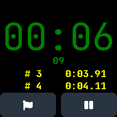

The stopwatch measures passed time in minutes, seconds and hundredths of seconds.

When the stop watch is not running, the left button shows a stop symbol and resets the current time to zero. It is not clickable when the time is already zero.
The right button shows a start symbol and starts the stop watch.

While the stop watch is running, the left button shows a flag.
Tapping it allows to register an intermediate time without stopping the measurement. 
The last two intermediate times are shown below the running time besides.
The right button shows a pause symbol. Tapping it pauses the measurement (without resetting it).

## Music player

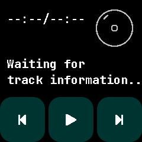

## Navigation directions

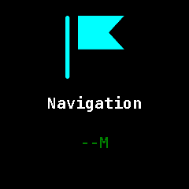

## Steps

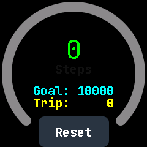

The steps screen shows the current number of steps in the middle and your current steps goal and trip count underneath.
Around it is a circular meter that shows how much of your goal you already achieved.

The steps count is measured daily and will be reset at midnight.
You can configure your step goal in the settings.

Your trip steps will not be reset at midnight.
You can do this yourself by pressing the Reset button on the bottom of the screen.

## Heart-rate

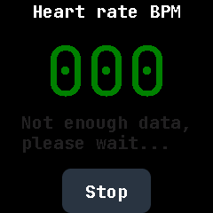

The heart rate app measures your heart rate using the sensor on the backside of the watch. When you activate the heart rate measurement, a fast blinking green light comes out of .

At the beginning, the measurement is turned off.
The screen shows a grey "000" and "stopped" underneath.
Press the "Start"-button at the bottom of the screen activate the measurement.
After starting the measurement, the measurement should become green and the text underneath should be "Not enough data, please wait ...". 
After a short while (~ 10 seconds), the text should be "Measuring ..." and on the top there should be a number that is your measured heart rate.

To stop the measurement, press the button at the bottom, which should now be labeled with "Stop".

*Keep in mind that InfiniTime and the PineTime watch are no medical devices. The measured number is not guaranteed to be your actual heart rate. See this feature more as a toy.*

## Timer

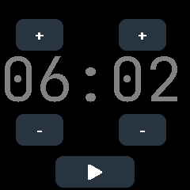

The Timer app lets you set a timer after which your watch will vibrate once and wake up if it was asleep.

The screen shows two digits for minutes and two digits for seconds, each with a button labeled "+" above and a button labeled "-" beneath.
Tapping those buttons lets you set the desired duration until the timer vibrates.

At the bottom of the screen is a button with a play icon.
Tapping it activates the timer and changes the play button to a pause button.
Tapping the pause button pauses the timer.

## Paint

InfiniPaint is an app that lets you draw using the touchscreen.

At the start, the app will show a black screen.
Touching the screen will let you draw white pixels.
If you hold a touch for long enough, there will be a vibration and you will have a new color.

## Pong

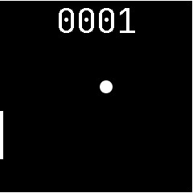

Pong is a little game that you can play.
In the middle of the screen is a little ball that will bounce of the walls except the left one.
At the left side there is a bar that will bounce the ball.
You can control it by touching the screen
Each time you keep the ball inside the screen will earn you one point.
Your points are shown at the top of the screen.
Try to get as many points as possible.

## 2048

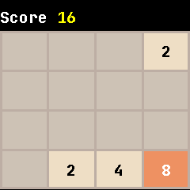

2048 is a puzzle game you can play.
At the start, you can see a four by four grid of cells and your score at the top, which should be zero.
Some of the cells will be filled with numbers that are powers of two.
Your goal is to make as many moves as possible and thereby earn as many points as possible.
You make a move by swiping either up, down, left or right.
All numbers on the grid will then move as far in this direction as possible. 
When two numbers with the same values collide, they will be added to a single cell.

## Accelerometer

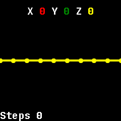

The accelerometer visualizes the accelerations along the x, y and z axis that are measured by the motion sensor of the watch.
In the bottom left corner, it also shows your current step count.

## Metronome

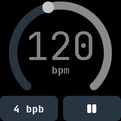

The metronome app lets you have a vibrating metronome on your wrist.
The metronome vibrates on each beat.
The first beat of each bar is stronger than the other ones.

Move the dot on the arc to change the bpm (beats per minute) that are shown in the middle.

On the bottom are two buttons.
Tapping the left one opens a scrollable list from which you can select how many bpb (beats per bar) you would like to have. 
Tap a number in the list to select it.
The right button shows a play sign if the metronome is paused and a pause sign if the metronome is running. 
Use it to start or pause the metronome.

## Alarm

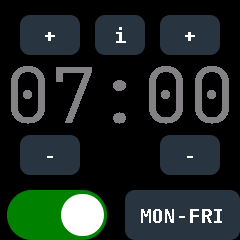

The alarm app lets you set an alarm to wake you up in the morning (or whenever).

The screen contains two digits for the hour on the left and two digits for the minutes on the right.
Above and beneath each are buttons labeled with "+" and "-" that let you modify the time.

At the bottom of the screen there are two buttons.
The left one is either grey and labeled "OFF" or green and labeled "ON". Tapping it, toggles it between those two. It shows whether the alarm is active or not.
The right button is labeled either "ONCE", "DAILY" or "MON-FRI". Tapping it cycles between those three. It shows on which days the alarm will ring when it is active.

At the top, in the middle is a button labeled "i".
Tapping it informs you, how many time is left before the next alarm.

When the alarm rings, the watch vibrates repeatedly and shows the alarm app.
The bottom left button is then red and labeled with a stop sign.
Press it, to end the ringing.
