# User documentation

This part of the documentation is meant for end users.   
For developer documentation, please refer to [this page](/developer-documentation/index.html)

## Getting started with InfiniTime

### Unboxing your PineTime

The box contains:

- the PineTime,
- a USB-A charger/craddle,
- a quick user guide.

### Boot/Reboot/Switch off InfiniTime

The PineTime has a single button, located on the left hand side.   

- To start/boot your PineTime, simply hold the button for a few seconds until
  the Pine64 logo appears,
  - if nothing happens, you may have to charge the watch beforehand.
- To reboot/restart the watch, press and hold the button for approximately 8
  seconds
  - Release the button at that stage, otherwise you will trigger another action
    (see [Recovery
    firmware](index.html#firmware-bootloader-recovery-firmware) and [Firmware
    validation](index.html#firmware-validation)
    for more details).
- It is **not** possible to switch it off.

### Setting up date and time

By default, InfiniTime starts on the digital watchface. It'll probably display
the epoch time (1 Jan 1970, 00:00).

You can set the time (and date) manually, or have a companion app do it for you.

InfiniTime doesn't handle daylight savings automatically, so make sure to set
the correct time or sync with a companion app.

#### Using companion apps

Date and time are set by the companion app once the PineTime is connected over
BLE.

#### Manually

Starting with InfiniTime 1.7, it is possible to configure the date and
time directly from the watch.

This can be done from the Settings menu, then "Set date" and "Set time"
respectively:

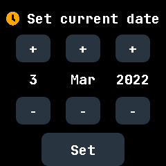
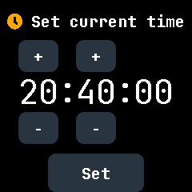

#### Using any Chromium-based web-browser

You can use [WebBLE](https://hubmartin.github.io/WebBLEWatch/) from a
Chromium-based browser (Chrome, Chromium, Edge, Chrome Android) to setup the
date and time.

(insert here pics of WebBLE GH)

#### Using NRFConnect

You must enable the **CTS** *GATT* server into NRFConnect so that InfiniTime can
synchronize the time with your smartphone.

Launch NRFConnect, tap the sandwich button on the top left and select *Configure
GATT server*:

Tap *Add service* and select the server configuration *Current Time service*.
Tap OK and connect to your PineTime, it should automcatically sync the time once
the connection is established!

(insert pics from
https://github.com/InfiniTimeOrg/InfiniTime/blob/develop/doc/gettingStarted/ota-gadgetbridge-nrfconnect.md#using-nrfconnect-1)

### Companion apps

PineTime can be used as a standalone watch, displaying date and time (which can
be configured from the watch itself since InfiniTime 1.7.0), as well as
heart-rate, number of steps, used as a torchlight, or just to play the included
games (2048, Pong, and Draw).   

To get more features, Companion apps, which are applications running on a
smartphone or a computer, and are paired to the PineTime, are required.   

There are multiple Companion apps available:

- [Gadgetbridge](https://gadgetbridge.org/) (Android)
- [AmazFish](https://openrepos.net/content/piggz/amazfish/) (SailfishOS)
- [Siglo](https://github.com/alexr4535/siglo) (Linux)
- [InfiniLink](https://github.com/InfiniTimeOrg/InfiniLink) (iOS) **[Looking for a new maintainer]**
- [ITD](https://gitea.arsenm.dev/Arsen6331/itd) (Linux)
- [WatchMate](https://github.com/azymohliad/watchmate) (Linux)

### The InfiniTime UI

The UI is composed of 4 different areas:
- the main watchface
- the notification screen (swipe down)
- apps drawer (swipe up)
- quick settings (swipe right)

#### Watchfaces

The default watchface is the "digital one", which displays date and time, as
well as the number of steps, heart-rate, bluetooth icon (when connected),
battery status, and possibly missed notifications.

There are 2 other watchfaces:

- Analog 
- PineTimeStyle

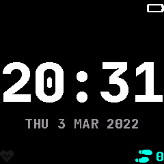
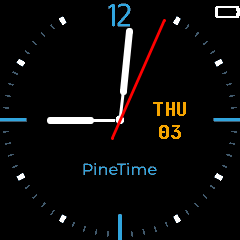

#### Notification screen

When swiping down, the last notification is displayed.   
Up to 5 notifications can be displayed: simply swipe up again the display the
next notification.   
To come back to the watchface, press the left button.

It is currently not possible to discard notifications, unless you restart
InfiniTime (long press on the button for ~8 seconds).

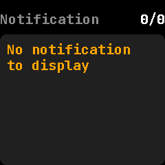

#### Apps drawer

When swiping up, the apps drawer allows launching applications.

There are 2 pages with each 6 applications (2 rows of 3 apps):

Page 1:
- Stopwatch
- Music control
- Navigation (only works with PureMaps/Sailfish OS)
- Steps counter
- Heart-rate
- Countdown 

Page 2:
- Draw
- Pong game
- 2048 game
- Accelerometer
- Metronome
- Alarm

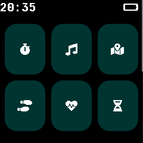
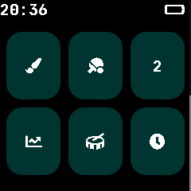

#### Quick settings

When swiping right, you get access to 4 icons :

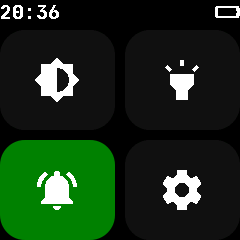

- brightness level: pressing it will cycle between 3 levels (low/medium/high)
- torch: 
  - a tap launches it, 
  - another tap switches it on, 
  - another one switches it off,
  - swiping to the right or left changes the brightness level of the torch
- silent mode:
  - a green bell symbol means silent mode is off (so the watch will vibrate when
    receiving a notification),
  - taping it enables it: the icon becomes grey, and the watch will not vibrate
    when receiving notifications)
- settings: access to InfiniTime settings

The following settings are available:

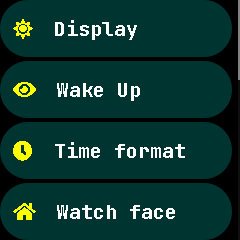
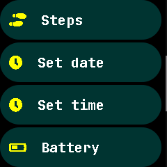
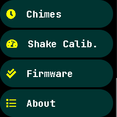

- Display timeout (in seconds)
- Wake up: how to wake up the watch
    - nothing selected means only the left button wakes up the watch
    - single tap: tap one time on the screen to wake up the watch
    - double tap: tap two times to wake it up
    - raise wrist: screen will wake up when you raise your wrist
- Time format: 12h or 24h
- Watch face: choose between digital, analog and PineTimeStyle
- Steps: define your daily goal
- Set date: allows manually setting date
- Set time: allows manually setting time
- Battery: displays battery level and voltage
- Chimes: Emit a small vibration every hour or half-hour
- Shake calibration: calibration the sensitivity of the "shake to wake" functionality
- Firmware: displays information about the InfiniTime version
- About: displays information about InfiniTime, the Bootloader, uptime, etc

## Flash And Upgrade

### Bootloader, Firmware and recovery firmware

#### Firmware, InfiniTime, Bootloader, Recovery firmware, OTA, DFU... What is it?

You may have already encountered these words by reading the announcement,
release notes, or [the wiki
guide](https://wiki.pine64.org/wiki/Upgrade_PineTime_to_InfiniTime_1.0.0) and
you may find them confusing if you're not familiar with the project.

A **firmware** is software running on the embedded hardware of a device.

InfiniTime has three distinct firmwares:
- [InfiniTime](https://github.com/InfiniTimeOrg/InfiniTime) is the operating system.
- [The bootloader](https://github.com/JF002/pinetime-mcuboot-bootloader) is responsible for safely applying firmware updates and runs before booting into InfiniTime.
- **The recovery firmware** is a special *application firmware* than can be
  loaded by the bootloader on user request. This firmware can be useful in case
  of serious issue, when the main application firmware cannot perform an OTA
  update correctly.

**OTA** (**O**ver **T**he **A**ir) refers to updating of the firmware over BLE
(Bluetooth Low Energy). This is a functionality that allows the user to update
the firmware on their device wirelessly.

**DFU** (**D**evice **F**irmware **U**pdate) is the file format and protocol
used to send the update of the firmware to the watch over-the-air. InfiniTime
implements the (legacy) DFU protocol from Nordic Semiconductor (NRF).

#### Bootloader

The
[bootloader](https://github.com/JF002/pinetime-mcuboot-bootloader/releases/tag/1.0.0)
is run right before booting into InfiniTime.   
It is easily recognizable with its white pine cone that is progressively drawn
in green. It also displays its own version at the bottom (1.0.0 as of now).

Most of the time, the bootloader just runs without your intervention (update and load the firmware).

However, you can enable 2 functionalities using the push button:

- Push the button until the pine cone is drawn in blue to force the rollback of
  the previous version of the firmware, even if you've already validated the
  updated one
- Push the button until the pine cone is drawn in red to load the recovery
  firmware. This recovery firmware only provides BLE connectivity and OTA
  functionality.

More info about the bootloader on [its project
page](https://github.com/JF002/pinetime-mcuboot-bootloader/blob/master/README.md).

#### The firmware

Well, it's InfiniTime :)   

You can check the InfiniTime version by first swiping right on the watchface to
open quick settings, tapping the cogwheel to open settings, swipe up until you
find an entry named "About" and tap on it.

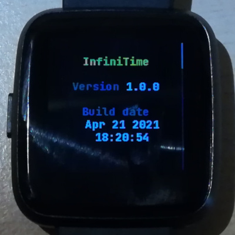

#### Recovery firmware

The *recovery functionality* allows to load a [recovery
firmware](https://github.com/InfiniTimeOrg/InfiniTime/releases/tag/0.14.1) from
the external flash memory to recover the PineTime when the current firmware
cannot boot anymore. 

This recovery firmware is a slightly modified version of InfiniTime that only
provides a basic UI and the OTA functionality. You'll be able to use this
firmware to load a new firmware over-the-air using BLE connectivity.

[This
article](https://www.ncartron.org/pinetimes-infinitime-new-bootloader-and-a-recovery-firmware.html)
describes how to upgrade your PineTime to benefit from this feature.

PineTime units shipped after (confirm date with JF) come with the recovery
firmware already installed, so there's no need to follow this procedure.

### Upgrading your PineTime

There are 2 ways to upgrade your PineTime:
- "Over-The-Air", i.e. using the Bluetooth connectivity to send firmware from a
  companion app: this is recommended for sealed devices
- using the SWD interface: only possible for dev / non-sealed units, as it
  requires access to the internals of the watch.

#### Over-The-Air (OTA)

To update your PineTime, you can use one of the compatible companion
applications.

The updating process differs slightly on every companion app, so you'll need to
familiarize yourself with the companion app of your choice.

All releases of InfiniTime are available on [the release page of the GitHub
repo](https://github.com/InfiniTimeOrg/InfiniTime/releases)
under assets.

To update the firmware, you need to download the DFU of the firmware version
that you'd like to install, for example `pinetime-mcuboot-app-dfu-1.6.0.zip`, and
flash it with your companion app.

##### Using Gadgetbridge

(Pics from [the original
article](https://github.com/InfiniTimeOrg/InfiniTime/blob/develop/doc/gettingStarted/ota-gadgetbridge.md)
will be added soon).

###### Connecting to Gadgetbridge

- Launch Gadgetbridge and tap on the "+" button on the bottom right to add a new device:
(add pic)

- Wait for the scan to complete, your PineTime should be detected:
(add pic)

- Tap on it. Gadgdetbridge will pair and connect to your device:
(add pic)

###### Updating with Gadgetbridge

Now that Gadgetbridge is connected to your PineTime, use a file browser
application and find the DFU file (`pinetime-mcuboot-app-dfu-x.x.x.zip`) you
downloaded previously.    
Tap on it and open it using the Gadgetbridge application/firmware installer:   
(add pic)

Read carefully the warning and tap Install:   
(add pic)

Wait for the transfer to finish. Your PineTime should reset and reboot with the
new version of InfiniTime!

Don't forget to validate your firmware. In the InfiniTime go to the settings
(swipe right, select gear icon) and Firmware option and click validate.
Otherwise after reboot the previous firmware will be used.

(add pic)

##### Using Amazfish

Please see [this
article](https://www.ncartron.org/upgrading-pinetimes-infinitime-firmware.html)
which describes how to use Amazfish on Sailfish OS to upgrade your PineTime.   
Instructions also apply if you're running Amazfish on Linux.

##### Using ITD

ITD comes with a graphical user interface, called `itgui`, which allows
upgrading InfiniTime.    
Please see [ITD's README](https://gitea.arsenm.dev/Arsen6331/itd/#itgui) for
more details.

##### Using NRFConnect

- Open NRFConnect. Swipe down in the Scanner tab and wait for your device to appear:   
(add pic)

- Tap on the *Connect* button on the right of your device. NRFConnect will connect
  to your PineTime and discover its characteristics. Tap on the DFU button on
  the top right:   
  (add pic)

- Select Distribution packet (ZIP):  
  (add pic)

- Find the DFU file (`pinetime-mcuboot-app-dfu-x.x.x.zip`) you downloaded
  previously, the DFU transfer will start automatically. When the transfer is
  finished, your PineTime will reset and restart on the new version of
  InfiniTime!
  Don't forget to validate your firmware. In the InfiniTime go to the settings
  (swipe right, select gear icon) and Firmware option and click validate.
  Otherwise after reboot the previous firmware will be used.

#### Using the SWD interface

Download the files bootloader.bin, image-x.y.z.bin and
pinetime-graphics-x.y.z.bin from the [releases
page](https://github.com/InfiniTimeOrg/InfiniTime/releases).

The bootloader reads a boot logo from the external SPI flash memory. The first
step consists of flashing a tool in the MCU that will flash the boot logo into
this SPI flash memory. This first step is optional but recommended (the
bootloader will display garbage on screen for a few second if you don't do it).
Using your SWD tool, flash pinetime-graphics-x.y.z.bin at offset 0x0000. Reset
the MCU and wait for a few second, until the logo is completely drawn on the
display.

Then, using your SWD tool, flash those file at specific offset:

- bootloader.bin : **0x0000**
- image-x.y.z.bin : **0x8000**

Reset and voilà, you're running InfiniTime on your PineTime!

### Firmware validation

Firmware updates must be manually validated. If the firmware isn't validated and
the watch resets, the watch will revert to the previous firmware. This is a
safety feature to prevent bricking your device with faulty firmware.

You can validate your updated firmware on InfiniTime >= 1.0 by following this
simple procedure:

- From the watchface, swipe right to display the quick settings menu
- Open settings by tapping the cogwheel on the bottom right
- Swipe up until you find an entry named Firmware and tap on it
- If the firmware is not validated yet, you can either validate the running
  firmware, or reset and revert to the previous firmware version

## Troubleshooting

### Bluetooth connectivity

InfiniTime versions prior to 1.6.0 "Ice Apple" had a known BLE bug, which caused
lost of Bluetooth connectivity after a few hours.   
The only way to fix this was to restart the watch (by holding the button for ~8
seconds).

This bug has been fixed, and with 1.6 and onwards, BLE connectivity is a lot
more reliable.
